# API Performance Observatory

> Enterprise-grade API monitoring platform built with Go, PostgreSQL and React.

## Table of Contents

- [Overview](#overview)
- [Getting Started & Configuration](#getting-started--configuration)
- [Technology Stack](#technology-stack)
- [Backend Architecture](#backend-architecture)
- [Frontend Architecture](#frontend-architecture)
- [Monitoring Engine](#monitoring-engine)
- [API Reference](#api-reference)
- [Project Structure](#project-structure)
- [Development Workflow](#development-workflow)
- [Contributing](#contributing)
- [License](#license)

---

## Overview

The **API Performance Observatory** is an enterprise-grade monitoring solution designed to provide real-time visibility into the health, performance, and reliability of HTTP endpoints. It automates the lifecycle of endpoint monitoring—from scheduled health checks and response time tracking to automated incident detection and historical uptime reporting.

The system is built as a decoupled, two-tier application featuring a high-concurrency Go backend and a modern React-based single-page application (SPA).

## System Architecture

The project follows a standard client-server architecture. The backend manages the persistent state and the execution of monitoring tasks, while the frontend provides a rich visualization layer for telemetry data.

### High-Level Component Interaction

The following diagram illustrates the relationship between the core system components and their corresponding code entities.

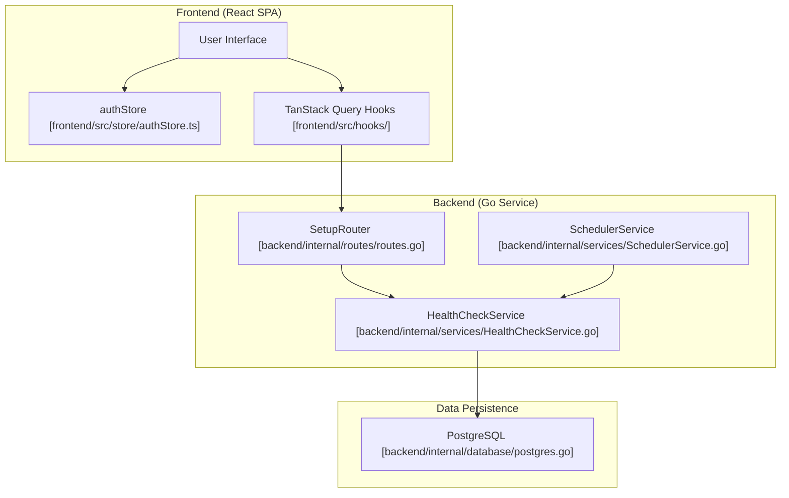
```mermaid
flowchart TD
 subgraph subGraph2 ["Data Persistence"]
 DB["PostgreSQL #91;backend/internal/database/postgres.go#93;"]
 end
 subgraph subGraph1 ["Backend (Go Service)"]
 Router["SetupRouter #91;backend/internal/routes/routes.go#93;"]
 Sched["SchedulerService #91;backend/internal/services/SchedulerService.go#93;"]
 HCS["HealthCheckService #91;backend/internal/services/HealthCheckService.go#93;"]
 end
 subgraph subGraph0 ["Frontend (React SPA)"]
 UI["User Interface"]
 Store["authStore #91;frontend/src/store/authStore.ts#93;"]
 Query["TanStack Query Hooks #91;frontend/src/hooks/#93;"]
 end
 UI --> Store
 UI --> Query
 Query --> Router
 Router --> HCS
 Sched --> HCS
 HCS --> DB
```


## Key Capabilities

- **Automated Monitoring:** A background scheduler triggers health checks at configurable intervals 
- **Incident Management:** Automatic creation and resolution of incidents based on endpoint availability 
- **Performance Analytics:** Calculation of uptime percentages, average response times, and success rates across various time windows.
- **Real-time Visualization:** A comprehensive dashboard featuring 3D visualizations, performance charts, and live incident logs 
- **Secure Access:** JWT-based authentication for managing endpoints and viewing private telemetry 

## Two-Tier Stack

### Go Backend

The backend is a high-performance service written in Go, utilizing the Gin web framework for routing and GORM for database interactions. It manages a concurrent worker pool to execute health checks without blocking API requests.

- **Entrypoint:**`main.go` handles dependency injection and server lifecycle 
- **Database:** PostgreSQL is used for persistence, with automatic schema migrations for `User`, `Endpoint`, `HealthCheck`, `Incident`, and `Monitoring` models 

### React Frontend

The frontend is a TypeScript SPA built with React 19 and Vite. It emphasizes a "NOC (Network Operations Center)" aesthetic using Tailwind CSS and Recharts.

- **State Management:** Uses Zustand for authentication state and TanStack Query for server-state synchronization 
- **Visuals:** Integrates `Cobe` for 3D globe visualizations and `Lucide` for iconography 

## Navigation & Documentation Structure

This wiki is organized into several key areas to assist with onboarding and technical deep dives:

| Section | Description |
| --- | --- |
| **[Getting Started & Configuration](/Abhi78k/api-performance-observatory/1.1-getting-started-and-configuration)** | Environment setup, database configuration, and local development instructions. |
| **[Technology Stack](/Abhi78k/api-performance-observatory/1.2-technology-stack)** | In-depth look at the libraries and frameworks used in both tiers. |
| **Backend Architecture** | Detailed documentation of the Go internal layers (Services, Repositories, Handlers). |
| **Frontend Architecture** | Breakdown of React components, hooks, and the Vision UI design system. |
| **Monitoring Engine** | Deep dive into the scheduler logic and incident state machine. |

For a step-by-step guide on how to run the project locally, please see the **[Getting Started & Configuration](/Abhi78k/api-performance-observatory/1.1-getting-started-and-configuration)** page. For more information on the specific libraries used, refer to the **[Technology Stack](/Abhi78k/api-performance-observatory/1.2-technology-stack)** page.


---

# Getting-Started-&-Configuration

# Getting Started & Configuration
This page provides a comprehensive guide for setting up the API Performance Observatory locally. The project consists of a Go-based backend and a React/Vite frontend, requiring a PostgreSQL database for persistence.

## Environment Configuration

The application uses environment variables for configuration. The backend utilizes `godotenv` to load `.env` files while the frontend uses Vite's built-in environment variable support.

### Backend Configuration

The backend `Config` struct defines the required parameters. The `Load` function attempts to read these from a `.env` file or the system environment.

| Variable | Description | Default (Example) |
| --- | --- | --- |
| `DB_HOST` | PostgreSQL host address | `localhost` |
| `DB_PORT` | PostgreSQL port | `5432` |
| `DB_USER` | Database username | `postgres` |
| `DB_PASSWORD` | Database password | - |
| `DB_NAME` | Database name | `api_observatory` |
| `DATABASE_URL` | Full connection string (overrides individual DB fields) | - |
| `JWT_SECRET` | Secret key for signing HS256 JWT tokens | - |
| `FRONTEND_URL` | URL of the frontend for CORS configuration | `http://localhost:5173` |

### Frontend Configuration

The frontend configuration is managed via `.env` files in the `frontend/` directory 

| Variable | Description |
| --- | --- |
| `VITE_API_BASE_URL` | The base path for API calls (proxied by Vite) |
| `VITE_USE_MOCK` | Toggle for using mock data instead of live API |


---

## Database Setup & Connection

The project uses GORM as its ORM and PostgreSQL as the primary data store. The connection logic is encapsulated in `ConnectDB`

### Connection Logic

The system supports two methods of connection:

1. **DSN Construction**: If `DATABASE_URL` is empty, it constructs a DSN using `DB_HOST`, `DB_USER`, etc. 
2. **Direct URL**: If `DATABASE_URL` is provided, it uses that string directly 

### Initialization Flow

Upon startup, `main.go` triggers `ConnectDB` and immediately runs `AutoMigrate` to synchronize the schema for the following models: `User`, `Endpoint`, `HealthCheck`, `Incident`, and `Monitoring`

**Database Initialization Sequence**

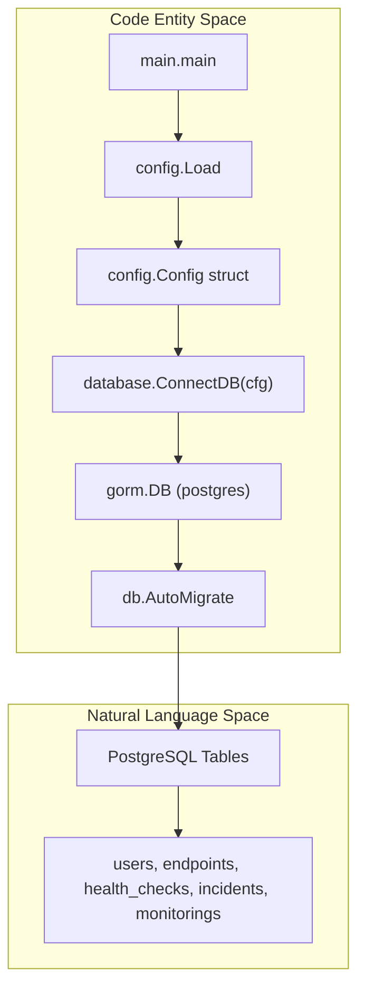
```mermaid
flowchart TD
 subgraph subGraph1 ["Natural Language Space"]
 G["PostgreSQL Tables"]
 H["users, endpoints, health_checks, incidents, monitorings"]
 end
 subgraph subGraph0 ["Code Entity Space"]
 A["main.main"]
 B["config.Load"]
 C["config.Config struct"]
 D["database.ConnectDB(cfg)"]
 E["gorm.DB (postgres)"]
 F["db.AutoMigrate"]
 end
 A --> B
 B --> C
 C --> D
 D --> E
 E --> F
 F --> G
 G --> H
```


---

## Local Development Setup

### Backend Execution

The backend is a Go application located in `backend/cmd/server/main.go`. It initializes the logger, database, repositories, services, and handlers before starting a Gin-based HTTP server 

1. Navigate to the backend directory.
2. Ensure Go 1.22+ is installed.
3. Run `go run cmd/server/main.go`.

The server defaults to port `8080` unless the `PORT` environment variable is set 

### Frontend Execution

The frontend is built with React 19 and Vite It uses a proxy configuration in `vite.config.ts` to route `/api` requests to the backend server at `http://localhost:8080`

1. Navigate to the `frontend/` directory.
2. Install dependencies: `npm install`.
3. Start the development server: `npm run dev`.

The frontend will be accessible at `http://localhost:5173`.

**Development Service Interaction**

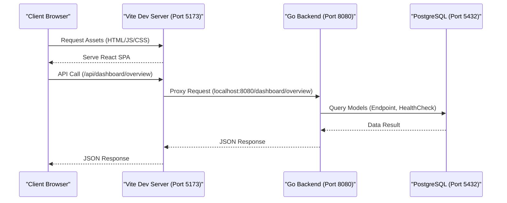
```mermaid
sequenceDiagram
 participant Browser as "Client Browser"
 participant Vite as "Vite Dev Server (Port 5173)"
 participant Go as "Go Backend (Port 8080)"
 participant DB as "PostgreSQL (Port 5432)"
 Browser->>Vite: Request Assets (HTML/JS/CSS)
 Vite-->>Browser: Serve React SPA
 Browser->>Vite: API Call (/api/dashboard/overview)
 Vite->>Go: Proxy Request (localhost:8080/dashboard/overview)
 Go->>DB: Query Models (Endpoint, HealthCheck)
 DB-->>Go: Data Result
 Go-->>Vite: JSON Response
 Vite-->>Browser: JSON Response
```


---

## Service Lifecycle & Shutdown

The backend manages two primary concurrent processes:

1. **HTTP Server**: Handles incoming REST requests 
2. **Scheduler**: A background goroutine that triggers periodic health checks 

### Graceful Shutdown

The application listens for `SIGINT` and `SIGTERM` signals When a signal is received, it initiates a graceful shutdown sequence:

1. It stops the scheduler via `context.CancelFunc`
2. It shuts down the HTTP server with a 10-second timeout to allow active requests to finish 


---

# Technology-Stack

# Technology Stack
This page provides a detailed technical breakdown of the dependencies and architectural choices for the API Performance Observatory. The project utilizes a modern, decoupled architecture with a Go-based RESTful backend and a React 19 single-page application (SPA).

## Backend Stack

The backend is built using **Go 1.26.4** prioritizing high-performance execution and efficient concurrency for the monitoring scheduler.

### Core Frameworks & Libraries

| Library | Role | Implementation Detail |
| --- | --- | --- |
| **Gin Gonic** | HTTP Web Framework | Handles routing, middleware, and JSON serialization |
| **GORM** | ORM | Provides an abstraction layer for PostgreSQL, handling schema migrations and complex queries |
| **PostgreSQL** | Primary Database | Stores user data, endpoint configurations, health check logs, and incidents |
| **JWT (v5)** | Authentication | Used for stateless session management via signed tokens |
| **Godotenv** | Configuration | Loads environment variables from `.env` files for local development |

### Backend Interaction Diagram

This diagram illustrates how the backend components interact within the "Code Entity Space."

**Backend Data Flow**

```

```


---

## Frontend Stack

The frontend is a modern React SPA built with **React 19** and **Vite 8** It emphasizes type safety via TypeScript and declarative data fetching.

### Core Libraries

- **React 19 & Vite**: Utilizes the latest React features for UI rendering and Vite for extremely fast HMR (Hot Module Replacement) and optimized production builds 
- **TanStack Query (v5)**: Manages server-side state, caching, and synchronization. It handles the lifecycle of API requests (loading, error, success) 
- **Zustand**: A lightweight state management library used specifically for client-side authentication state (`authStore`) 
- **Tailwind CSS (v4)**: A utility-first CSS framework used for styling components without writing custom CSS files 
- **Recharts**: A composable charting library used to visualize response times and success rates over time 
- **Axios**: The underlying HTTP client used by TanStack Query to communicate with the Go backend 

### Frontend Interaction Diagram

This diagram maps the frontend libraries to their specific roles in the application architecture.

**Frontend Library Orchestration**

```

```


---

## Technology Interaction Summary

The interaction between the frontend and backend is strictly decoupled via a REST API.

1. **Configuration**: The backend `config.Load` function reads environment variables (e.g., `DB_HOST`, `JWT_SECRET`) The frontend uses Vite environment variables (e.g., `VITE_API_BASE_URL`) to point to the backend.
2. **Database Connection**: The `ConnectDB` function in `postgres.go` initializes the GORM connection using a DSN (Data Source Name) constructed from the `Config` struct 
3. **Authentication**: The backend issues JWTs upon successful login. The frontend stores this state in a Zustand store and includes the token in Axios requests (typically via cookies or headers).
4. **Data Flow**:

- **Backend**: `Gin` routes request to `Handlers` -> `Services` -> `Repositories` -> `GORM` -> `PostgreSQL`.
- **Frontend**: `React Components` -> `TanStack Query Hooks` -> `Axios API Client` -> `Backend API`.


---

# Backend-Architecture

# Backend Architecture
The API Performance Observatory backend is a structured Go application designed for high-concurrency monitoring and data aggregation. It follows a clean, layered architecture that separates concerns between the entrypoint, routing, business logic, and data persistence.

## Architecture Overview

The system is organized into a unidirectional flow where each layer depends on the layer below it. This separation ensures that business logic is decoupled from HTTP concerns and database implementations.

### Layered Structure

- **cmd/server**: The entrypoint that initializes the application, wires dependencies, and manages the server lifecycle.
- **routes**: Defines the HTTP API surface and applies global/group-level middleware.
- **handlers**: Orchestrates the HTTP request/response cycle, parsing input and calling services.
- **services**: The core business logic layer where complex operations and cross-repository orchestrations occur.
- **repositories**: Abstracted data access layer using GORM to interact with PostgreSQL.
- **models**: Centralized GORM struct definitions representing the database schema.

### Dependency Injection Pattern

The application uses manual dependency injection at startup in `main.go`. Repositories are instantiated first with a database handle, followed by services (which receive repositories), and finally handlers (which receive services).

### Request Flow Diagram

The following diagram illustrates how a request travels through the system and how the various layers interact.

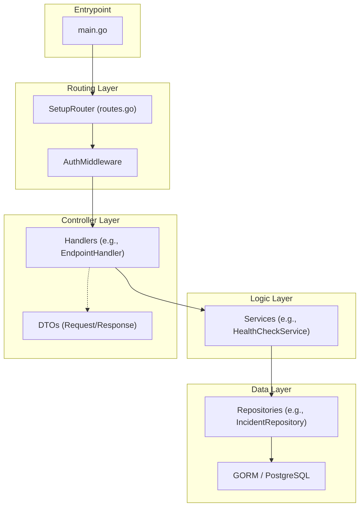
```mermaid
flowchart TD
 subgraph subGraph4 ["Data Layer"]
 Repos["Repositories (e.g., IncidentRepository)"]
 GORM["GORM / PostgreSQL"]
 end
 subgraph subGraph3 ["Logic Layer"]
 Services["Services (e.g., HealthCheckService)"]
 end
 subgraph subGraph2 ["Controller Layer"]
 Handlers["Handlers (e.g., EndpointHandler)"]
 DTOs["DTOs (Request/Response)"]
 end
 subgraph subGraph1 ["Routing Layer"]
 Router["SetupRouter (routes.go)"]
 Middleware["AuthMiddleware"]
 end
 subgraph Entrypoint
 Main["main.go"]
 end
 Main --> Router
 Router --> Middleware
 Middleware --> Handlers
 Handlers --> Services
 Services --> Repos
 Repos --> GORM
 Handlers -.-> DTOs
```


---

## Component Breakdown

### 2.1 Server Entrypoint & Lifecycle

The `main` function in `backend/cmd/server/main.go` serves as the application's brain. It handles configuration loading, database connectivity, and the simultaneous execution of the Gin HTTP server and the background `SchedulerService`. It also implements a graceful shutdown mechanism that allows active checks to finish within a 10-second window.

For details, see [Server Entrypoint & Lifecycle](/Abhi78k/api-performance-observatory/2.1-server-entrypoint-and-lifecycle).

### 2.2 HTTP Routing & Middleware

Routing is centralized in `backend/internal/routes/routes.go`. It utilizes the Gin framework to organize endpoints into logical groups such as `/auth`, `/endpoints`, and `/dashboard`. A critical component here is the `AuthMiddleware`, which enforces JWT validation for all protected resources.

For details, see [HTTP Routing & Middleware](/Abhi78k/api-performance-observatory/2.2-http-routing-and-middleware).

### 2.3 Data Models & Database

The backend uses GORM for Object-Relational Mapping. The schema consists of five primary models: `User`, `Endpoint`, `HealthCheck`, `Incident`, and `Monitoring`. The database connection logic in `postgres.go` supports both unified connection strings and individual host/port configurations.

For details, see [Data Models & Database](/Abhi78k/api-performance-observatory/2.3-data-models-and-database).

### 2.4 Repository Layer

Repositories encapsulate all GORM queries, providing a clean interface for the service layer. This layer handles pagination logic and ensures that database contexts are properly propagated. For example, the `IncidentRepository` provides specialized methods like `GetActiveIncidents` to filter the state of the system.

For details, see [Repository Layer](/Abhi78k/api-performance-observatory/2.4-repository-layer).

### 2.5 Service Layer

The service layer contains the "heavy lifting" of the application. It is divided into twelve files, each handling a specific domain. This layer manages the complex relationships between entities, such as the `HealthCheckService` triggering the `IncidentService` when an endpoint fails.

For details, see [Service Layer](/Abhi78k/api-performance-observatory/2.5-service-layer).

### 2.6 Handlers & DTOs

Handlers bridge the gap between HTTP and business logic. They use Data Transfer Objects (DTOs) to ensure that internal models are never exposed directly to the API consumer. Standardized JSON responses are generated using utility helpers to maintain consistency across the API.

For details, see [Handlers & DTOs](/Abhi78k/api-performance-observatory/2.6-handlers-and-dtos).

### 2.7 Authentication & Security

Security is managed via JWT (JSON Web Tokens) stored in cookies. The system handles bcrypt password hashing during registration and provides a secure `AuthMiddleware` to inject user identity into the request context for downstream services.

For details, see [Authentication & Security](/Abhi78k/api-performance-observatory/2.7-authentication-and-security).

---

## Entity Interaction Diagram

This diagram maps the natural language concepts of the system to the specific code entities that implement them.

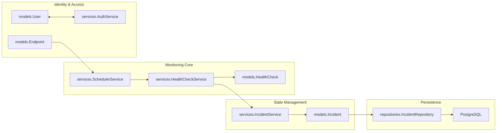
```mermaid
flowchart LR
 subgraph Persistence
 IncRepo["repositories.IncidentRepository"]
 DB["PostgreSQL"]
 end
 subgraph subGraph2 ["State Management"]
 IncSvc["services.IncidentService"]
 IncModel["models.Incident"]
 end
 subgraph subGraph1 ["Monitoring Core"]
 Sched["services.SchedulerService"]
 CheckSvc["services.HealthCheckService"]
 Log["models.HealthCheck"]
 end
 subgraph subGraph0 ["Identity & Access"]
 User["models.User"]
 AuthSvc["services.AuthService"]
 Target["models.Endpoint"]
 end
 Target --> Sched
 Sched --> CheckSvc
 CheckSvc --> Log
 CheckSvc --> IncSvc
 IncSvc --> IncModel
 IncModel --> IncRepo
 IncRepo --> DB
 User <--> AuthSvc
```


---

# Server-Entrypoint-&-Lifecycle

# Server Entrypoint & Lifecycle
This page details the initialization, execution, and termination phases of the backend service. The entrypoint is located in `backend/cmd/server/main.go`, which serves as the orchestrator for dependency injection, concurrent service execution, and graceful system shutdown.

## Initialization Sequence

The `main` function follows a strict linear sequence to ensure that infrastructure (logging, database) is available before domain logic is initialized.

1. **Logging**: Initializes the global `slog` instance 
2. **Configuration**: Loads environment variables into a structured `Config` object 
3. **Database Connection**: Establishes a connection to PostgreSQL via GORM 
4. **Auto-Migration**: Synchronizes the database schema for all core models (`User`, `Endpoint`, `HealthCheck`, `Incident`, `Monitoring`) 
5. **Dependency Wiring**: Instantiates the Repository-Service-Handler layers using manual dependency injection 

### Dependency Graph Initialization

The following diagram illustrates how components are wired together during the startup phase.

**System Initialization Flow**

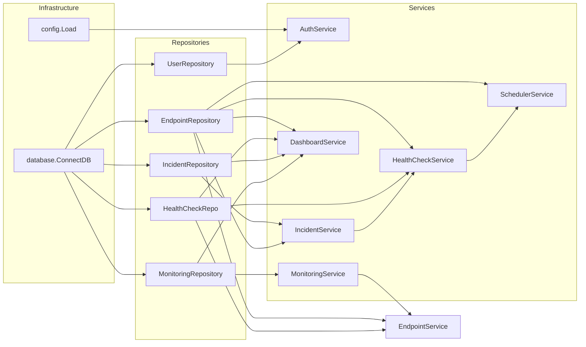
```mermaid
flowchart LR
 ES["EndpointService"]
 subgraph Services
 AS["AuthService"]
 MS["MonitoringService"]
 IS["IncidentService"]
 HCS["HealthCheckService"]
 SS["SchedulerService"]
 DS["DashboardService"]
 end
 subgraph Repositories
 UR["UserRepository"]
 ER["EndpointRepository"]
 HCR["HealthCheckRepo"]
 IR["IncidentRepository"]
 MR["MonitoringRepository"]
 end
 subgraph Infrastructure
 DB["database.ConnectDB"]
 CFG["config.Load"]
 end
 DB --> UR
 DB --> ER
 DB --> HCR
 DB --> IR
 DB --> MR
 CFG --> AS
 UR --> AS
 MR --> MS
 ER --> ES
 MS --> ES
 HCR --> ES
 IR --> IS
 ER --> IS
 ER --> HCS
 HCR --> HCS
 IS --> HCS
 ER --> SS
 HCS --> SS
 ER --> DS
 HCR --> DS
 IR --> DS
 MR --> DS
```


## Concurrent Execution

The application manages two primary concurrent workloads: the HTTP server and the background monitoring scheduler.

### 1. Background Scheduler

The `SchedulerService` is started in its own goroutine It receives an `appCtx` context, which is used to signal the background worker to stop when the application begins its shutdown sequence 

### 2. HTTP Server

The Gin router is configured and wrapped in a standard `http.Server` The server is launched in a non-blocking goroutine to allow the main thread to listen for termination signals 

| Component | Execution Mode | Role |
| --- | --- | --- |
| `SchedulerService.Start` | Goroutine | Periodically triggers health checks for registered endpoints. |
| `http.Server.ListenAndServe` | Goroutine | Handles incoming REST API requests on the configured port. |
| `main` thread | Blocking | Waits on the `quit` channel for OS signals. |


## Graceful Shutdown & Lifecycle Management

The application implements a graceful shutdown pattern to ensure that in-flight requests are completed and background tasks are terminated cleanly before the process exits.

### Signal Handling

The main thread blocks on a `quit` channel, which is notified by `os.Interrupt` (SIGINT) or `syscall.SIGTERM`

### Shutdown Sequence

Once a signal is received, the following steps occur:

1. **HTTP Server Shutdown**: The `server.Shutdown(ctx)` method is called with a **10-second timeout** This stops the server from accepting new requests while allowing existing ones to finish.
2. **Context Cancellation**: The `stop` function (the cancel function for `appCtx`) is called This signals the `SchedulerService` to cease all background monitoring operations.

**Shutdown Logic Flow**

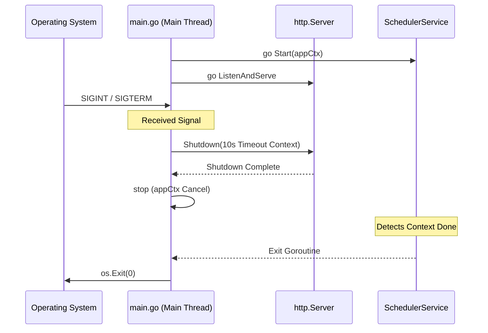
```mermaid
sequenceDiagram
 participant OS as Operating System
 participant Main as main.go (Main Thread)
 participant Srv as http.Server
 participant Sch as SchedulerService
 Main->>Sch: go Start(appCtx)
 Main->>Srv: go ListenAndServe
 OS->>Main: SIGINT / SIGTERM
 Note over Main: Received Signal
 Main->>Srv: Shutdown(10s Timeout Context)
 Srv-->>Main: Shutdown Complete
 Main->>Main: stop (appCtx Cancel)
 Note over Sch: Detects Context Done
 Sch-->>Main: Exit Goroutine
 Main->>OS: os.Exit(0)
```


---

# HTTP-Routing-&-Middleware

# HTTP Routing & Middleware
The API Performance Observatory utilizes the **Gin Web Framework** to manage its HTTP interface. The routing layer is responsible for cross-origin resource sharing (CORS) configuration, request authentication via JWT, and dispatching requests to the appropriate handlers.

## Router Configuration

The central entry point for the HTTP server is the `SetupRouter` function It initializes the Gin engine and configures the middleware stack and route groups.

### CORS Middleware

The system implements a strict CORS policy to ensure the backend only accepts requests from the configured frontend origin.

- **Allowed Origins**: Dynamically set via `cfg.FrontendURL`
- **Allowed Methods**: GET, POST, PUT, PATCH, DELETE, OPTIONS 
- **Credentials**: Enabled (`AllowCredentials: true`) to support cookie-based JWT transmission 

### Route Groups

Routes are organized into logical groups based on the resource they manage. Most groups are protected by the `AuthMiddleware`.

| Group | Prefix | Auth Required | Handler Responsibility |
| --- | --- | --- | --- |
| **Auth** | `/auth` | No (mostly) | User registration, login, and logout. |
| **Endpoints** | `/endpoints` | Yes | CRUD operations for monitored URLs and stats. |
| **HealthChecks** | `/healthchecks` | Yes | Retrieval of historical check logs. |
| **Incidents** | `/incidents` | Yes | Management of active and resolved incidents. |
| **Dashboard** | `/dashboard` | Yes | Aggregated telemetry for the frontend UI. |

### Data Flow: Request to Handler

The following diagram illustrates how a request flows through the Gin router, middleware, and into the handler logic.

**Request Processing Pipeline**

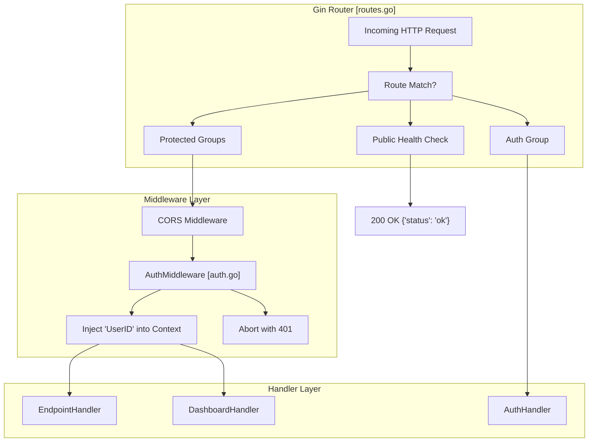
```mermaid
flowchart TD
 M["200 OK {'status': 'ok'}"]
 subgraph subGraph2 ["Handler Layer"]
 I["EndpointHandler"]
 J["DashboardHandler"]
 K["AuthHandler"]
 end
 subgraph subGraph1 ["Middleware Layer"]
 E["CORS Middleware"]
 F["AuthMiddleware #91;auth.go#93;"]
 G["Inject 'UserID' into Context"]
 H["Abort with 401"]
 end
 subgraph subGraph0 ["Gin Router #91;routes.go#93;"]
 A["Incoming HTTP Request"]
 B["Route Match?"]
 C["Auth Group"]
 D["Protected Groups"]
 L["Public Health Check"]
 end
 A --> B
 B --> C
 B --> D
 B --> L
 D --> E
 E --> F
 F --> G
 F --> H
 G --> I
 G --> J
 C --> K
 L --> M
```


---

## JWT Authentication Middleware

The `AuthMiddleware` is a sentinel that protects all sensitive data. It does not use the `Authorization` header by default; instead, it looks for an `access_token` cookie 

### Implementation Details

1. **Token Retrieval**: Attempts to extract the JWT from the `access_token` cookie. If missing, it returns a `401 Unauthorized` response and calls `c.Abort`
2. **Validation**: Calls `auth.ValidateToken` using the application's `JWT_SECRET`
3. **Claims Extraction**: Parses the token into a `*auth.Claims` struct to retrieve the `UserID`
4. **Context Injection**: Stores the `UserID` in the Gin context using `c.Set("UserID", claims.UserID)` This allows downstream handlers to filter data specifically for the authenticated user.


---

## Route Definitions

### Endpoint Management (`/endpoints`)

This group handles the core monitoring targets. It includes sub-routes for telemetry specific to a single endpoint.

- `POST /endpoints`: Creates a new monitoring target 
- `GET /endpoints/:id/stats`: Retrieves performance metrics via `statsHandler.GetEndpointStats`
- `GET /endpoints/:id/incidents`: Fetches incidents filtered by a specific endpoint ID 

### Dashboard Aggregation (`/dashboard`)

The dashboard routes provide high-level summaries. These handlers typically call services that aggregate data across multiple repositories.

- `/overview`: High-level counts (Total, Healthy, Unhealthy) 
- `/performance`: Average response times across all endpoints 
- `/monitoring`: Global monitoring status for 3D globe visualization 

### Code Entity Mapping

The following diagram maps the HTTP paths defined in `routes.go` to the specific Handler methods and Repository interfaces they eventually trigger.

**Route to Code Entity Mapping**

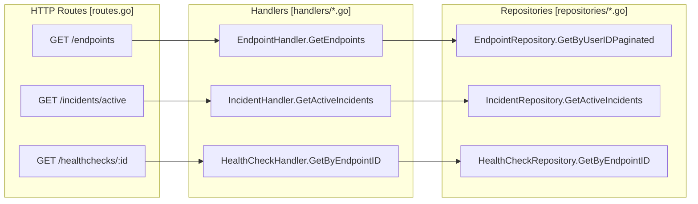
```mermaid
flowchart LR
 subgraph subGraph2 ["Repositories #91;repositories/*.go#93;"]
 Repo1["EndpointRepository.GetByUserIDPaginated"]
 Repo2["IncidentRepository.GetActiveIncidents"]
 Repo3["HealthCheckRepository.GetByEndpointID"]
 end
 subgraph subGraph1 ["Handlers #91;handlers/*.go#93;"]
 H1["EndpointHandler.GetEndpoints"]
 H2["IncidentHandler.GetActiveIncidents"]
 H3["HealthCheckHandler.GetByEndpointID"]
 end
 subgraph subGraph0 ["HTTP Routes #91;routes.go#93;"]
 R1["GET /endpoints"]
 R2["GET /incidents/active"]
 R3["GET /healthchecks/:id"]
 end
 R1 --> H1
 H1 --> Repo1
 R2 --> H2
 H2 --> Repo2
 R3 --> H3
 H3 --> Repo3
```


---

## Pagination Utility

Most `GET` list routes utilize a standardized pagination helper located in `utils/response.go`.

- **`GetPaginationParams`**: Extracts `page` and `limit` from query parameters, providing defaults (page 1, limit 10) and enforcing a maximum limit of 100 
- **`PaginatedOK`**: Wraps the data response with a `pagination` metadata object containing `totalPages`, `hasNext`, and `hasPrevious` flags 


---

# Data-Models-&-Database

# Data Models & Database
This section documents the persistence layer of the API Performance Observatory. The system utilizes **PostgreSQL** as its primary data store, managed via the **GORM** ORM. The architecture follows a strict separation between database models (entities) and the repository layer that interacts with them.

## Database Connection & Configuration

The database connection logic is encapsulated in `backend/internal/database/postgres.go`. The system supports two methods for providing connection details, prioritized by the `ConnectDB` function.

### DSN Selection Logic

The `Config` struct in `backend/internal/config/config.go` loads environment variables using `godotenv`. The connection logic in `ConnectDB` evaluates these variables to build the Data Source Name (DSN):

1. **Primary**: If `DATABASE_URL` is provided, it is used directly as the DSN 
2. **Fallback**: If `DATABASE_URL` is empty, the DSN is constructed using individual fields: `DB_HOST`, `DB_USER`, `DB_PASSWORD`, `DB_NAME`, and `DB_PORT`

The connection is established using `gorm.Open` with the `postgres` driver Once connected, the instance is stored in a global `DB` variable for package-level access 

### Connection Flow Diagram

This diagram illustrates the transition from environment configuration to the initialized GORM database instance.

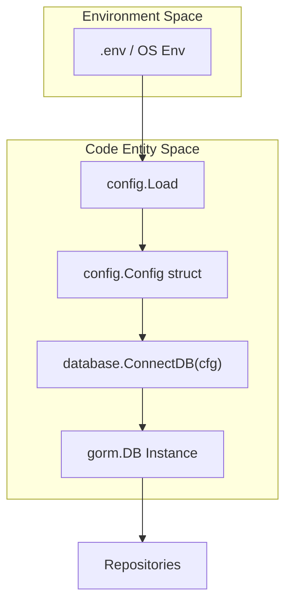
```mermaid
flowchart TD
 REPOS["Repositories"]
 subgraph subGraph1 ["Code Entity Space"]
 LOAD["config.Load"]
 CFG["config.Config struct"]
 CONN["database.ConnectDB(cfg)"]
 GORM["gorm.DB Instance"]
 end
 subgraph subGraph0 ["Environment Space"]
 ENV[".env / OS Env"]
 end
 ENV --> LOAD
 LOAD --> CFG
 CFG --> CONN
 CONN --> GORM
 GORM --> REPOS
```


---

## GORM Models

The system defines five core models in the `models` package. These models represent the schema and relationships within the PostgreSQL database.

### 1. User

Represents an authenticated user of the platform.

- **File**: `backend/internal/models/user.go`
- **Fields**:

- `ID`: Primary Key.
- `Email`: Unique string used for login.
- `Password`: Hashed string (bcrypt).

### 2. Endpoint

The central entity representing a monitored API.

- **File**: `backend/internal/models/endpoint.go`
- **Fields**:

- `ID`: Primary Key.
- `UserID`: Foreign key linking to the `User` who owns the endpoint.
- `URL`: The target address to monitor.
- `CheckInterval`: Frequency of health checks in minutes.
- `ExpectedStatus`: The HTTP status code indicating "Healthy" (defaults to 200).
- **Calculated Fields**: The struct includes fields like `Status` and `ResponseTime` tagged with `gorm:"-"` These are populated dynamically by services and are not persisted in the `endpoints` table.

### 3. HealthCheck

Logs the result of every individual ping to an endpoint.

- **File**: `backend/internal/models/health_check.go`
- **Fields**:

- `EndpointID`: Foreign key to `Endpoint`.
- `StatusCode`: The actual HTTP response code received.
- `ResponseTime`: Latency in milliseconds.
- `Success`: Boolean indicating if the check met the `ExpectedStatus`.
- `CheckedAt`: Timestamp of the execution.

### 4. Incident

Tracks periods of downtime (unhealthy state).

- **File**: `backend/internal/models/incident.go`
- **Fields**:

- `EndpointID`: Foreign key to `Endpoint`.
- `StartedAt`: When the first failed health check occurred.
- `ResolvedAt`: When the endpoint returned to a healthy state (nullable).
- `IsResolved`: Boolean flag for active vs. historical incidents.

### 5. Monitoring

Metadata regarding the monitoring status of an endpoint.

- **File**: `backend/internal/models/monitoring.go`
- **Fields**:

- `EndpointID`: Unique foreign key to `Endpoint`.
- `MonitoringStartedAt`: Timestamp when the observatory began tracking this endpoint.

---

## Entity Relationships & Data Flow

The following diagram maps the relationships between the GORM models and how data flows from a User action to the persistence of monitoring logs.


---

## Repository Implementation Patterns

The repository layer abstracts GORM queries, ensuring that handlers and services do not interact with the database directly.

### Context Propagation

All repository methods accept a `context.Context` to support cancellation and timeouts GORM queries use `.WithContext(ctx)` to ensure the database operation respects the request lifecycle 

### Pagination and Filtering

The `GetByUserIDPaginated` method in `EndpointRepository` demonstrates the standard pattern for data retrieval:

1. **Filtering**: Applies `LOWER(name) LIKE...` for search and subqueries for status filtering 
2. **Counting**: Executes a `Count` query to return the total record count for frontend pagination 
3. **Limiting**: Applies `Offset(offset).Limit(limit)` before the final `Find`

### Repository Methods Example: HealthCheck

The `HealthCheckRepository` provides specialized queries such as `GetLatestByEndpointID`, which uses `.Order("checked_at DESC").First(&check)` to retrieve the most recent status for the dashboard 


---

# Repository-Layer

# Repository Layer
The Repository Layer acts as the data access abstraction for the API Performance Observatory. It encapsulates all `GORM` operations, isolating the database logic from the business services. This layer utilizes interfaces to facilitate dependency injection and follows consistent patterns for pagination, filtering, and context propagation.

### Repository Architecture

The codebase defines five primary repositories, each paired with an interface to ensure loose coupling. These repositories handle CRUD operations and complex queries for the system's core entities.

| Repository | Interface | Primary Responsibility |
| --- | --- | --- |
| `UserRepository` | `UserRepositoryInterface` | User registration and credential retrieval. |
| `EndpointRepository` | `EndpointRepositoryInterface` | Management of monitored URLs and ownership filtering. |
| `HealthCheckRepository` | `HealthCheckRepositoryInterface` | Logging of individual check results and status history. |
| `IncidentRepository` | `IncidentRepositoryInterface` | Lifecycle management of outages (creation to resolution). |
| `MonitoringRepository` | `MonitoringRepositoryInterface` | Persistence of static monitoring metadata (e.g., location data). |


### Natural Language to Code Entity Mapping

The following diagram maps high-level data requirements to the specific repository methods and GORM entities responsible for fulfilling them.

**Entity Mapping Diagram**

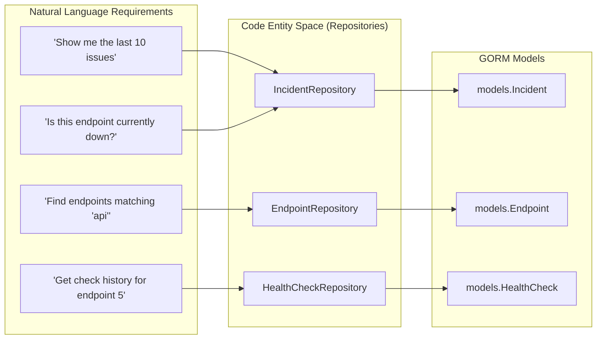
```mermaid
flowchart LR
 subgraph subGraph2 ["GORM Models"]
 MI["models.Incident"]
 ME["models.Endpoint"]
 MHC["models.HealthCheck"]
 end
 subgraph subGraph1 ["Code Entity Space (Repositories)"]
 IR["IncidentRepository"]
 ER["EndpointRepository"]
 HCR["HealthCheckRepository"]
 end
 subgraph subGraph0 ["Natural Language Requirements"]
 Req1["'Show me the last 10 issues'"]
 Req2["'Is this endpoint currently down?'"]
 Req3["'Find endpoints matching 'api''"]
 Req4["'Get check history for endpoint 5'"]
 end
 Req1 --> IR
 Req2 --> IR
 Req3 --> ER
 Req4 --> HCR
 IR --> MI
 ER --> ME
 HCR --> MHC
```


### Implementation Patterns

#### 1. Context Propagation

Every repository method accepts a `context.Context` as its first argument. This context is passed directly to GORM using `.WithContext(ctx)` to ensure that database queries respect request cancellation and timeouts initiated at the handler or service level.

*Example from IncidentRepository:*

#### 2. Pagination and Filtering

Pagination is implemented using a standard `offset` and `limit` pattern. Methods returning paginated data typically return the slice of records, a total count (`int64`), and an error.

- **Filtering:** Filters (like `search` or `status`) are applied conditionally to the `*gorm.DB` instance before execution.
- **Counting:** A separate `Count(&total)` call is performed on the query object before `Offset` and `Limit` are applied to ensure the total reflects the filtered set, not the entire table.

*Example: Endpoint Filtering logic:*

#### 3. Complex Queries and Subqueries

The repository layer handles specialized queries, such as determining an endpoint's health status based on its most recent health check record using a subquery.

**Data Flow: Paginated Endpoint Retrieval**

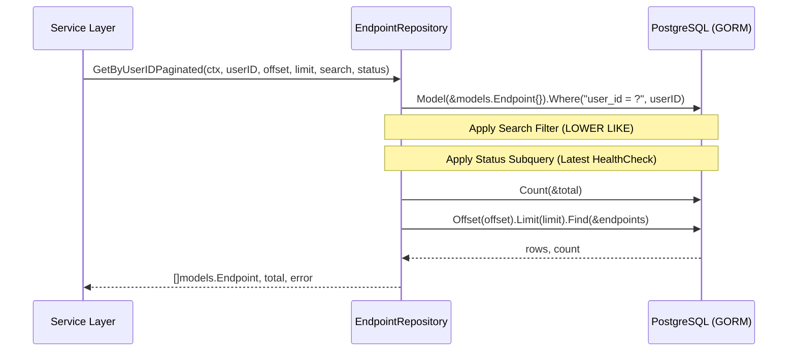
```mermaid
sequenceDiagram
 participant S as Service Layer
 participant R as EndpointRepository
 participant DB as PostgreSQL (GORM)
 S->>R: GetByUserIDPaginated(ctx, userID, offset, limit, search, status)
 R->>DB: Model(&models.Endpoint{}).Where("user_id = ?", userID)
 Note over R,DB: Apply Search Filter (LOWER LIKE)
 Note over R,DB: Apply Status Subquery (Latest HealthCheck)
 R->>DB: Count(&total)
 R->>DB: Offset(offset).Limit(limit).Find(&endpoints)
 DB-->>R: rows, count
 R-->>S: []models.Endpoint, total, error
```


### Key Repository Methods

#### IncidentRepository

Manages the state of endpoint failures. It provides specialized methods for the "Active Incident" pattern used by the monitoring engine to prevent duplicate incident creation.

- `GetActiveIncidentByEndpointID`: Uses `is_resolved = false` to find ongoing outages 
- `GetRecentIncidents`: Returns the 10 most recent incidents ordered by `started_at DESC` for the dashboard 

#### HealthCheckRepository

Stores the high-volume results of the scheduler's checks.

- `GetLatestByEndpointID`: Retrieves the single most recent check to determine current status 
- `GetAllPaginated`: Supports filtering by `endpointID` and `success` status 

#### EndpointRepository

The primary store for user-defined targets.

- `GetByID`: Enforces ownership by requiring both `id` and `userID`
- `Update`: Uses `r.db.Save(endpoint)` to persist changes to interval, URL, or name 

### Sources

- Repository Interfaces and Implementation: 
- Models and Schema: 
- Middleware Context usage: 

---

# Service-Layer

# Service Layer
The Service Layer acts as the central orchestrator for the API Performance Observatory, encapsulating all business logic and mediating between the [Handlers & DTOs](/Abhi78k/api-performance-observatory/2.6-handlers-and-dtos) and the [Repository Layer](/Abhi78k/api-performance-observatory/2.4-repository-layer). It is composed of twelve specialized services that handle everything from automated health check execution to complex statistical aggregation for the dashboard.

## Overview and Dependency Graph

The services are designed to be modular, with clear boundaries of responsibility. While some services are stateless (like the statistics engines), others maintain stateful workflows such as the monitoring scheduler and incident lifecycle management.

### Service Dependency Graph

The following diagram illustrates how the primary services interact with repositories and each other.

**Service Dependency Architecture**

```

```


---

## Core Monitoring Services

### Health Check & Scheduler Services

The `SchedulerService` runs a background ticker that periodically evaluates which endpoints require a check based on their `CheckInterval`. It dispatches tasks to the `HealthCheckService`, which performs the actual HTTP requests, measures latency, and determines success based on `ExpectedStatus`.

For a deep dive into the 3-retry logic, 10-second timeouts, and the semaphore-limited goroutine pool (max 10 concurrent checks), see **[Health Check & Scheduler Services](/Abhi78k/api-performance-observatory/2.5.1-health-check-and-scheduler-services)**.


### Incident Service & Statistics

The `IncidentService` manages the lifecycle of outages. When `HealthCheckService` detects a failure, it triggers `StartIncident`; once the endpoint recovers, it triggers `ResolveIncident`. Surrounding this lifecycle are several specialized statistics services (e.g., `UptimeReportService`, `PerformanceStatsService`) that calculate metrics like 30-day success rates and total downtime.

For details on uptime calculations and the incident state machine, see **[Incident Service & Statistics](/Abhi78k/api-performance-observatory/2.5.2-incident-service-and-statistics)**.


### Dashboard Service & Aggregation

The `DashboardService` is the primary aggregator for the frontend. It fetches data from all four repositories (`Endpoint`, `HealthCheck`, `Incident`, `Monitoring`) to build comprehensive DTOs. It handles the logic for "Healthy vs Unhealthy" counts and generates historical performance trends.

For details on the iterative N+1 lookup patterns and how data is transformed for the NOC console, see **[Dashboard Service & Aggregation](/Abhi78k/api-performance-observatory/2.5.3-dashboard-service-and-aggregation)**.

---

## Endpoint & Monitoring Management

### EndpointService

The `EndpointService` handles the CRUD operations for monitored targets. It is unique in that it coordinates with both the `MonitoringService` and `HealthCheckRepo` to provide a "live" status of endpoints during retrieval.

- **CreateEndpoint**: Persists the endpoint and immediately initializes a monitoring record via `MonitoringService.StartMonitoring`
- **GetEndpointsPaginated**: Retrieves endpoints and performs an in-memory join with the latest health check result to decorate the model with `Status` ("healthy", "unhealthy", or "unknown") and `ResponseTime`

### MonitoringService

A specialized service focused on the metadata of the monitoring process itself. It manages the `Monitoring` model, which tracks when an endpoint first entered the system.

- **StartMonitoring**: Creates the initial `Monitoring` record with a timestamp 
- **GetMonitoringResponse**: Transforms internal monitoring models into `dto.MonitoringResponse` for API consumption 


---

## Business Logic Encapsulation

The following table maps natural language business requirements to the specific code entities in the Service Layer:

| Business Requirement | Code Entity (Service/Method) | Description |
| --- | --- | --- |
| **Outage Detection** | `HealthCheckService.CheckEndpoint` | Executes HTTP GET and compares result to `ExpectedStatus`. |
| **Auto-Recovery** | `IncidentService.ResolveIncident` | Closes active incidents when a check succeeds. |
| **Concurrency Control** | `SchedulerService.Start` | Uses a semaphore to limit concurrent outbound requests. |
| **Status Aggregation** | `EndpointService.GetEndpointsPaginated` | Injects "healthy"/"unhealthy" strings based on latest DB records. |
| **Metric Reporting** | `PerformanceStatsService` | Calculates Min/Max/Avg response times across datasets. |


---

# Health-Check-&-Scheduler-Services

# Health Check & Scheduler Services
The monitoring engine of the API Performance Observatory relies on two primary components: the `SchedulerService`, which orchestrates the timing of checks, and the `HealthCheckService`, which executes the actual network requests and manages incident lifecycles based on the results.

## Scheduler Service

The `SchedulerService` is responsible for the periodic execution of health checks across all monitored endpoints. It operates as a background worker initialized during server startup.

### Execution Loop

The service utilizes a `time.NewTicker` set to a 1-minute interval In each cycle, it retrieves all endpoints from the `EndpointRepository`

### ShouldCheck Logic

To prevent over-monitoring, the service evaluates each endpoint using the `ShouldCheck` function. An endpoint is checked only if:

1. `LastCheckedAt` is nil or zero 
2. The current time is past the `LastCheckedAt` plus the defined `CheckInterval` (in minutes) 

### Concurrency Control

To manage system resources and prevent socket exhaustion, the scheduler implements a semaphore-limited goroutine pool:

- **Max Concurrency**: Limited to 10 concurrent checks using a buffered channel 
- **Synchronization**: A `sync.WaitGroup` ensures the cycle waits for all dispatched goroutines to complete before starting the next ticker wait 
- **State Update**: After a successful execution of `CheckEndpoint`, the scheduler updates the endpoint's `LastCheckedAt` timestamp in the database 


## Health Check Execution Flow

The `HealthCheckService.CheckEndpoint` function contains the core logic for probing an endpoint and determining its status.

### Request Logic

- **Timeout**: A hard 10-second timeout is enforced via `http.Client`
- **Retry Strategy**: The service performs up to 3 attempts using an `http.Get` request 
- **Backoff**: There is a 1-second sleep between retries 
- **Success Criteria**: A check is successful only if the response status code matches the `ExpectedStatus` defined for that endpoint 

### Data Persistence

Regardless of success or failure, a `models.HealthCheck` record is created containing the `ResponseTime` (measured in milliseconds), `StatusCode`, and `Success` boolean If the request fails entirely (e.g., DNS error), the `StatusCode` is recorded as 0 

### Incident Management

The service automatically manages the incident lifecycle by interacting with the `IncidentService`:

- **Failure**: If a check fails and no active incident exists for the endpoint, `StartIncident` is called 
- **Recovery**: If a check succeeds and an active incident is found, `ResolveIncident` is called to close the incident 


## Code Entity Mapping

### Scheduler to Health Check Flow

The following diagram illustrates how the `SchedulerService` interacts with the `HealthCheckService` and the repository layer.

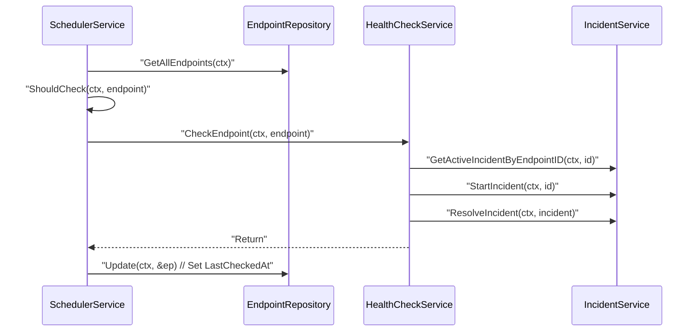
```mermaid
sequenceDiagram
 participant S as SchedulerService
 participant R as EndpointRepository
 participant H as HealthCheckService
 participant I as IncidentService
 S->>R: "GetAllEndpoints(ctx)"
 S->>S: "ShouldCheck(ctx, endpoint)"
 S->>H: "CheckEndpoint(ctx, endpoint)"
 H->>I: "GetActiveIncidentByEndpointID(ctx, id)"
 H->>I: "StartIncident(ctx, id)"
 H->>I: "ResolveIncident(ctx, incident)"
 H-->>S: "Return"
 S->>R: "Update(ctx, &ep) // Set LastCheckedAt"
```


### HealthCheckService Internal Logic

This diagram bridges the natural language requirements (retries, timeouts) to the specific code entities.

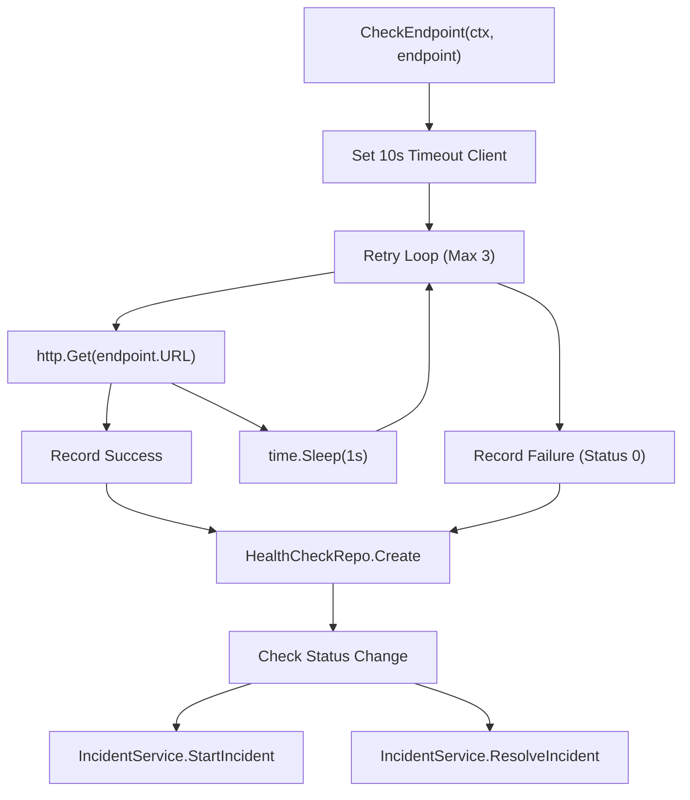
```mermaid
flowchart TD
 Start["CheckEndpoint(ctx, endpoint)"]
 Init["Set 10s Timeout Client"]
 RetryLoop["Retry Loop (Max 3)"]
 Get["http.Get(endpoint.URL)"]
 Success["Record Success"]
 Sleep["time.Sleep(1s)"]
 Fail["Record Failure (Status 0)"]
 SaveCheck["HealthCheckRepo.Create"]
 IncidentCheck["Check Status Change"]
 StartInc["IncidentService.StartIncident"]
 ResolveInc["IncidentService.ResolveIncident"]
 Start --> Init
 Init --> RetryLoop
 RetryLoop --> Get
 Get --> Success
 Get --> Sleep
 Sleep --> RetryLoop
 RetryLoop --> Fail
 Success --> SaveCheck
 Fail --> SaveCheck
 SaveCheck --> IncidentCheck
 IncidentCheck --> StartInc
 IncidentCheck --> ResolveInc
```


## Key Service Methods

| Method | Purpose | Source |
| --- | --- | --- |
| `CheckEndpoint` | Executes HTTP probe, logs results, and triggers incident logic. | [health_check_service.go27](https://github.com/Abhi78k/api-performance-observatory/blob/60b58e7b/health_check_service.go#L27-L27) |
| `Start` | Runs the 1-minute ticker loop for the background scheduler. | [scheduler_service.go41](https://github.com/Abhi78k/api-performance-observatory/blob/60b58e7b/scheduler_service.go#L41-L41) |
| `ShouldCheck` | Determines if an endpoint is due for a check based on interval. | [scheduler_service.go28](https://github.com/Abhi78k/api-performance-observatory/blob/60b58e7b/scheduler_service.go#L28-L28) |
| `GetAllPaginated` | Retrieves health check history with filters for UI display. | [health_check_service.go207](https://github.com/Abhi78k/api-performance-observatory/blob/60b58e7b/health_check_service.go#L207-L207) |
| `GetEndpointNamesMap` | Helper to map IDs to names for dashboard visualization. | [health_check_service.go228](https://github.com/Abhi78k/api-performance-observatory/blob/60b58e7b/health_check_service.go#L228-L228) |


---

# Incident-Service-&-Statistics

# Incident Service & Statistics
The Incident Service and its associated statistics services form the core of the API Performance Observatory's reliability tracking. This system manages the lifecycle of service outages—from detection to resolution—and computes metrics such as uptime percentage and downtime duration.

## Incident Service Lifecycle

The `IncidentService` manages the state of `models.Incident` entities. It acts as the bridge between the health check execution logic and the persistence layer, ensuring that outages are recorded and resolved accurately.

### Incident Detection and Creation

When the `HealthCheckService` detects a failure, it utilizes `GetActiveIncidentByEndpointID` to check for existing outages. If no active incident is found, `StartIncident` is invoked to create a new record.

- **StartIncident**: Initializes a new `models.Incident` with the current timestamp and `IsResolved` set to `false`
- **GetActiveIncidentByEndpointID**: Queries the repository for an incident where `IsResolved` is false for a specific endpoint 

### Incident Resolution

Once an endpoint returns a successful health check, the service transitions the incident to a resolved state.

- **ResolveIncident**: Updates the `ResolvedAt` timestamp and sets `IsResolved` to `true`. It includes safety logic to ensure `StartedAt` is populated if missing before calling the repository update 

### Data Retrieval and Pagination

The service provides multiple methods for retrieving incident data, supporting both the dashboard and dedicated incident management views.

| Method | Purpose | Implementation Detail |
| --- | --- | --- |
| `GetIncidentsPaginated` | General list retrieval | Calculates `offset` from `page` and `limit` |
| `GetActiveIncidentsPaginated` | Sidebar/Active alerts | Forces `isResolvedStr` to `"false"` |
| `GetEndpointNamesMap` | UI Data Enrichment | Returns a `map[uint]string` for quick lookup of endpoint names by ID |


## Incident Statistics Calculation

The `IncidentStatsService` is a stateless service responsible for deriving reliability metrics from raw incident data. It processes a slice of `models.Incident` to generate a `dto.IncidentStatsResponse`.

### Uptime and Downtime Logic

The service calculates downtime by iterating through incidents and determining the duration between `StartedAt` and `ResolvedAt` (or `time.Now` for ongoing incidents) 

**Uptime Percentage Calculation:**

1. **Baseline**: Uses a standard monthly baseline of 43,200 minutes (30 days) if the monitoring history is shorter 
2. **Formula**: `((MonitoringMinutes - TotalDowntimeMinutes) / MonitoringMinutes) * 100`
3. **Clamping**: Results are clamped between 0.0 and 100.0 to handle edge cases in calculation 

### Incident Statistics Entity Mapping

This diagram shows how the `IncidentStatsService` transforms database models into the Data Transfer Objects (DTOs) used by the frontend.

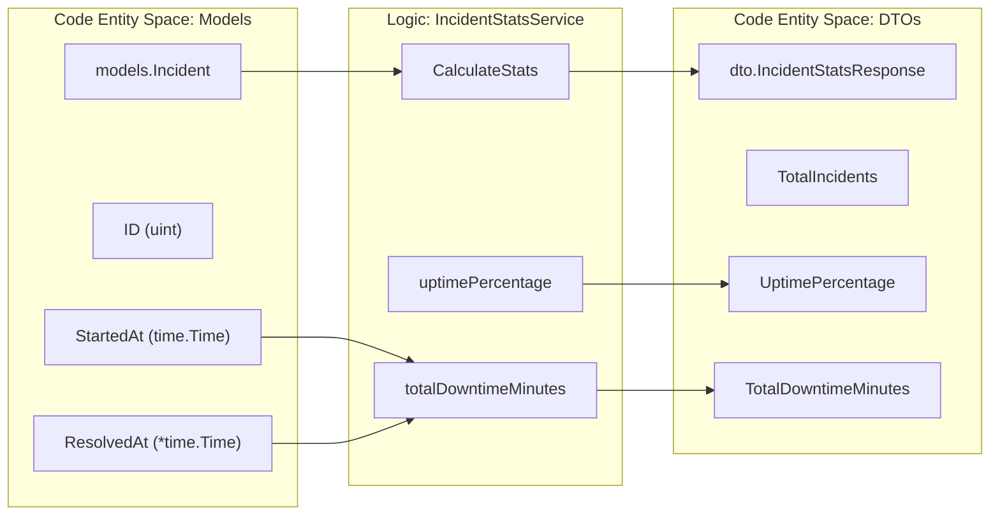
```mermaid
flowchart LR
 subgraph subGraph2 ["Code Entity Space: DTOs"]
 DTO_RES["dto.IncidentStatsResponse"]
 DTO_TOTAL["TotalIncidents"]
 DTO_UPTIME["UptimePercentage"]
 DTO_DOWNTIME["TotalDowntimeMinutes"]
 end
 subgraph subGraph1 ["Logic: IncidentStatsService"]
 FUNC_CALC["CalculateStats"]
 VAR_DOWN["totalDowntimeMinutes"]
 VAR_UP["uptimePercentage"]
 end
 subgraph subGraph0 ["Code Entity Space: Models"]
 M_INC["models.Incident"]
 M_INC_ID["ID (uint)"]
 M_INC_START["StartedAt (time.Time)"]
 M_INC_RES["ResolvedAt (*time.Time)"]
 end
 M_INC --> FUNC_CALC
 M_INC_START --> VAR_DOWN
 M_INC_RES --> VAR_DOWN
 VAR_DOWN --> DTO_DOWNTIME
 VAR_UP --> DTO_UPTIME
 FUNC_CALC --> DTO_RES
```


## Data Flow: Health Check to Incident

The following diagram illustrates the interaction between the monitoring execution and the incident lifecycle management.

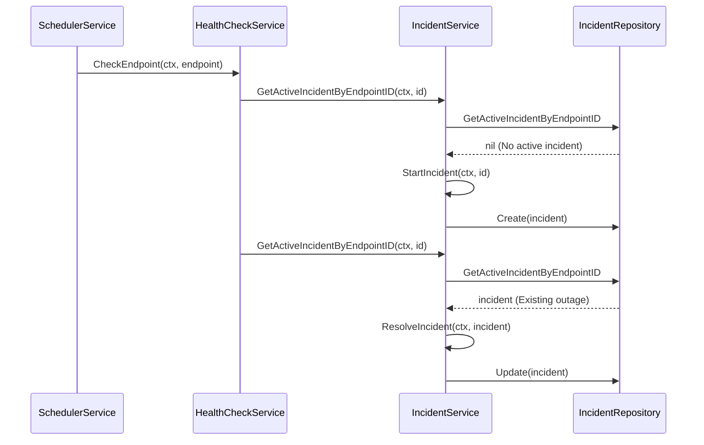
```mermaid
sequenceDiagram
 participant S as SchedulerService
 participant H as HealthCheckService
 participant I as IncidentService
 participant R as IncidentRepository
 S->>H: CheckEndpoint(ctx, endpoint)
 H->>I: GetActiveIncidentByEndpointID(ctx, id)
 I->>R: GetActiveIncidentByEndpointID
 R-->>I: nil (No active incident)
 I->>I: StartIncident(ctx, id)
 I->>R: Create(incident)
 H->>I: GetActiveIncidentByEndpointID(ctx, id)
 I->>R: GetActiveIncidentByEndpointID
 R-->>I: incident (Existing outage)
 I->>I: ResolveIncident(ctx, incident)
 I->>R: Update(incident)
```


## Specialized Statistics Services

The observatory utilizes several stateless services to provide specific dashboard metrics:

1. **UptimeReportService**: Aggregates uptime data for reporting periods.
2. **PerformanceStatsService**: Computes minimum, maximum, and average response times across health check records.
3. **SuccessRateService**: Calculates the ratio of successful checks (2xx/3xx) versus failures (4xx/5xx/timeouts).
4. **HistoricalReportService**: Generates a 30-day historical trend by combining performance and success rate data.

These services typically follow the pattern of the `IncidentStatsService`, taking a slice of models and returning a structured DTO.


---

# Dashboard-Service-&-Aggregation

# Dashboard Service & Aggregation
The `DashboardService` acts as the primary data orchestrator for the application's main landing page and global metrics views. It is responsible for aggregating raw data from the `EndpointRepository`, `HealthCheckRepository`, `IncidentRepository`, and `MonitoringRepository` into high-level Data Transfer Objects (DTOs).

The service frequently employs an iterative lookup pattern, where it fetches a list of entities and then performs subsequent queries or delegates to specialized stateless services to compute complex metrics like uptime percentages and historical trends.

## Service Architecture & Dependencies

The `DashboardService` is initialized with references to all four primary data repositories. It does not contain complex state itself but relies on the repository layer for persistence and specialized calculation services for logic.

### Dependency Graph: Natural Language to Code Entity Space

The following diagram maps the logical dashboard requirements to the specific Go structs and repositories that fulfill them.

**Dashboard Data Flow**

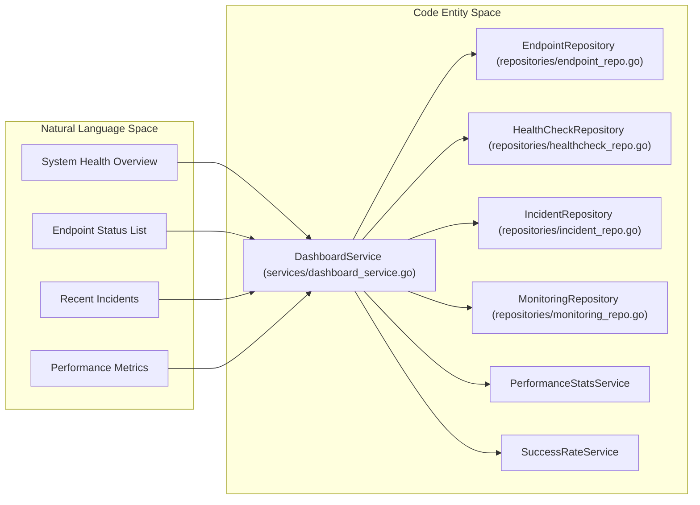
```mermaid
flowchart LR
 subgraph subGraph1 ["Code Entity Space"]
 DS["DashboardService (services/dashboard_service.go)"]
 ER["EndpointRepository (repositories/endpoint_repo.go)"]
 HR["HealthCheckRepository (repositories/healthcheck_repo.go)"]
 IR["IncidentRepository (repositories/incident_repo.go)"]
 MR["MonitoringRepository (repositories/monitoring_repo.go)"]
 PSS["PerformanceStatsService"]
 SRS["SuccessRateService"]
 end
 subgraph subGraph0 ["Natural Language Space"]
 Overview["System Health Overview"]
 StatusList["Endpoint Status List"]
 RecentInc["Recent Incidents"]
 PerfStats["Performance Metrics"]
 end
 Overview --> DS
 StatusList --> DS
 RecentInc --> DS
 PerfStats --> DS
 DS --> ER
 DS --> HR
 DS --> IR
 DS --> MR
 DS --> PSS
 DS --> SRS
```


## Key Aggregation Functions

### System Overview

The `GetOverview` function provides the "at-a-glance" counts seen at the top of the dashboard. It iterates through all endpoints to determine the health status of each based on the most recent check.

- **Logic:** Fetches all endpoints via `endpointRepo.GetAllEndpoints`. For each endpoint, it calls `healthCheckRepo.GetLatestByEndpointID` to increment `HealthyCount` or `UnhealthyCount`.
- **Monitoring Check:** It also verifies if monitoring has officially started for each endpoint by checking `monitoring.MonitoringStartedAt`.


### Endpoint Status & Pagination

The service provides both `GetStatus` and `GetStatusPaginated` to populate the main endpoint list. These functions transform `Endpoint` models into `DashboardStatusResponse` DTOs.

| Field | Source / Calculation |
| --- | --- |
| `Status` | "healthy" if latest `HealthCheck.Success` is true, else "unhealthy". Defaults to "unknown". |
| `MonitoringDurationDays` | `time.Since(monitoring.MonitoringStartedAt).Hours / 24.0` |


### Incident Join Logic

`GetRecentIncidents` demonstrates an in-memory join pattern. Instead of complex SQL joins, it fetches recent incidents and all endpoints separately, then maps the endpoint names to the incidents using a Go map (`namesMap`).


## Specialized Service Delegation

For complex statistical calculations, `DashboardService` instantiates and delegates to stateless services. This keeps the aggregation logic clean and reusable.

### Performance & Success Rates

The functions `GetPerformance`, `GetSuccessRate`, and `GetHistory` follow a similar pattern:

1. Fetch all `HealthCheck` records from the repository.
2. Instantiate a specialized service (e.g., `PerformanceStatsService`).
3. Return the result of the service's `CalculateStats` or `GenerateReport` method.


### Uptime Reporting

`GetUptime` delegates to the `UptimeReportService`, which specifically requires an `IncidentStatsService` to process downtime durations from the incident history.


## Data Flow Diagram: Request to DTO

This diagram illustrates how a request for the "30-day History" is processed through the service layer.

**History Aggregation Sequence**

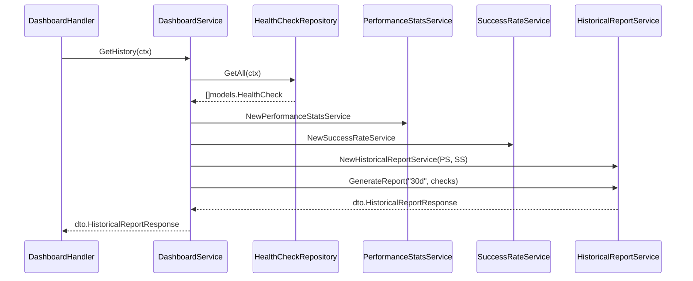
```mermaid
sequenceDiagram
 participant H as DashboardHandler
 participant S as DashboardService
 participant R as HealthCheckRepository
 participant PS as PerformanceStatsService
 participant SS as SuccessRateService
 participant HS as HistoricalReportService
 H->>S: GetHistory(ctx)
 S->>R: GetAll(ctx)
 R-->>S: []models.HealthCheck
 S->>PS: NewPerformanceStatsService
 S->>SS: NewSuccessRateService
 S->>HS: NewHistoricalReportService(PS, SS)
 S->>HS: GenerateReport("30d", checks)
 HS-->>S: dto.HistoricalReportResponse
 S-->>H: dto.HistoricalReportResponse
```


## Summary of Dashboard DTOs

The service produces several specialized DTOs defined in `backend/internal/dto/dashboard.go` and related files:

- **`DashboardOverviewResponse`**: Global counts of total, healthy, unhealthy, and monitored endpoints. 
- **`DashboardStatusResponse`**: Per-endpoint status and age of monitoring. 
- **`PerformanceStatsResponse`**: Min, Max, and Average response times across the system. 
- **`SuccessRateResponse`**: Total checks vs successful/failed counts and percentages. 
- **`HistoricalReportResponse`**: Aggregated performance and success metrics for a specific period (default "30d"). 

---

# Handlers-&-DTOs

# Handlers & DTOs
The **Handlers** layer in the API Performance Observatory serves as the interface between the HTTP routing layer and the internal business logic (Services). This layer is responsible for parsing incoming JSON requests, validating payloads using Data Transfer Objects (DTOs), invoking the appropriate service methods, and returning standardized JSON responses using centralized utility helpers.

## Request/Response Lifecycle

Handlers follow a consistent pattern to ensure predictable API behavior:

1. **Request Binding**: Handlers use `c.ShouldBindJSON` to map request bodies to DTO structs 
2. **Validation**: Payloads are validated using the `utils.Validate` singleton, which processes struct tags (e.g., `required`, `email`, `url`) 
3. **Service Invocation**: The handler extracts parameters (from path, query, or context) and calls the relevant service 
4. **Standardized Response**: Results are wrapped in standardized JSON envelopes via `utils/response.go` helpers 

### Data Flow Diagram

The following diagram illustrates the flow from a Gin HTTP request through the handler and DTO layers.

"Request-to-Response Flow"

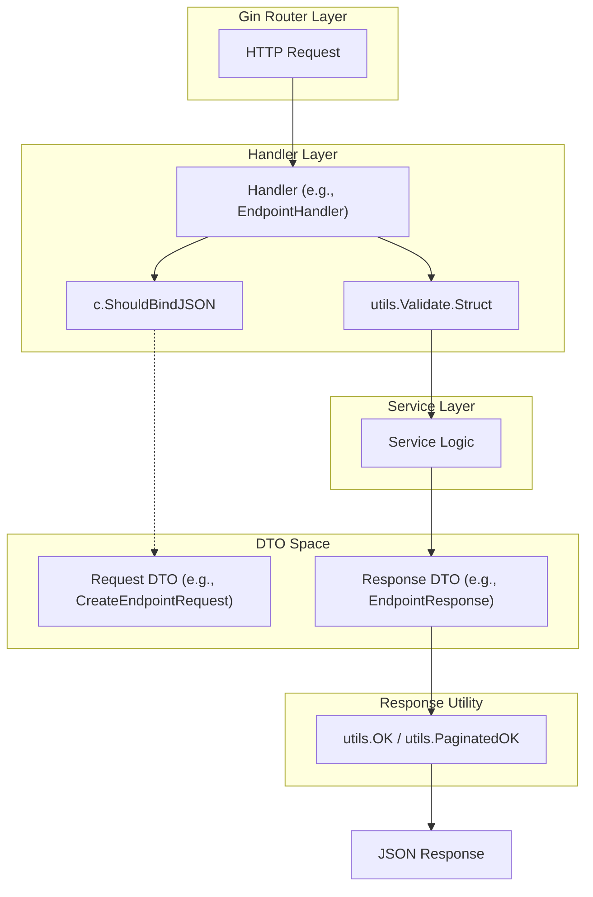
```mermaid
flowchart TD
 Response["JSON Response"]
 subgraph subGraph4 ["Response Utility"]
 Utils["utils.OK / utils.PaginatedOK"]
 end
 subgraph subGraph3 ["Service Layer"]
 Service["Service Logic"]
 end
 subgraph subGraph2 ["DTO Space"]
 DTO_Req["Request DTO (e.g., CreateEndpointRequest)"]
 DTO_Res["Response DTO (e.g., EndpointResponse)"]
 end
 subgraph subGraph1 ["Handler Layer"]
 Handler["Handler (e.g., EndpointHandler)"]
 Bind["c.ShouldBindJSON"]
 Val["utils.Validate.Struct"]
 end
 subgraph subGraph0 ["Gin Router Layer"]
 Request["HTTP Request"]
 end
 Request --> Handler
 Handler --> Bind
 Bind -.-> DTO_Req
 Handler --> Val
 Val --> Service
 Service --> DTO_Res
 DTO_Res --> Utils
 Utils --> Response
```


---

## Handler Implementations

The codebase contains seven specialized handlers, each injected with its corresponding service.

### 1. AuthHandler

Manages user lifecycle and session security.

- **`Register`**: Validates `RegisterRequest` and creates users 
- **`Login`**: Authenticates credentials and sets a secure `access_token` cookie with `httpOnly` and `SameSite` flags 
- **`Logout`**: Clears the authentication cookie by setting its expiration to -1 

### 2. EndpointHandler

Handles CRUD operations for monitored URLs.

- **`CreateEndpoint`**: Extracts `UserID` from the Gin context (injected by middleware) to associate the endpoint with the correct owner 
- **`GetEndpoints`**: Supports filtering via `search` and `status` query parameters 

### 3. DashboardHandler

Aggregates high-level metrics for the frontend overview.

- **`GetOverview`**: Returns counts of healthy/unhealthy endpoints 
- **`GetStatus`**: Returns paginated status for the main dashboard list 
- **`GetHistory`**: Provides 30-day historical performance data 

### 4. HealthCheck & Incident Handlers

Manage the logs and state of endpoint monitoring.

- **`GetAllHealthChecks`**: Provides paginated logs, often filtered by `endpoint_id`
- **`GetActiveIncidents`**: Returns incidents where `is_resolved` is false 


---

## Data Transfer Objects (DTOs)

DTOs decouple the internal database models (GORM) from the API's external contract. They ensure that sensitive fields (like password hashes) are never leaked and that the API remains stable even if the database schema changes.

### DTO Transformation Logic

Many DTO files include "Mapper" functions that convert GORM models into JSON-ready responses, often calculating derived fields like `duration_minutes` on the fly.

| DTO Function | Purpose | Logic |
| --- | --- | --- |
| `ToHealthCheckResponse` | Model → Response | Maps `StatusCode` and formats `CheckedAt` |
| `ToIncidentResponse` | Model → Response | Calculates `DurationMinutes` using `time.Since` if the incident is unresolved |
| `ToIncidentResponses` | Slice → Slice | Iteratively maps a list of incidents and attaches endpoint names from a map |

### Code Entity Association

"DTO and Handler Entity Mapping"

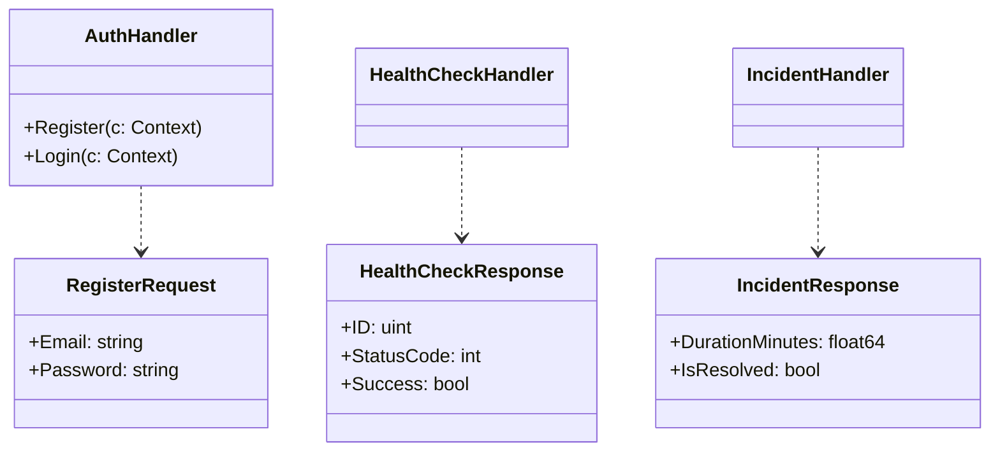
```mermaid
classDiagram
 class AuthHandler {
 +Register(c: Context)
 +Login(c: Context)
 }
 class RegisterRequest {
 +Email: string
 +Password: string
 }
 class HealthCheckResponse {
 +ID: uint
 +StatusCode: int
 +Success: bool
 }
 class IncidentResponse {
 +DurationMinutes: float64
 +IsResolved: bool
 }
 class HealthCheckHandler
 class IncidentHandler
 AuthHandler..> RegisterRequest
 HealthCheckHandler..> HealthCheckResponse
 IncidentHandler..> IncidentResponse
```


---

## Response Helpers (`utils/response.go`)

The project uses a set of helper functions to ensure every API response follows the same JSON structure: `{ "success": bool, "data": any, "message": string }`.

### Standard Responses

- **`OK(c, data)`**: Returns HTTP 200 with the provided data 
- **`Created(c, data)`**: Returns HTTP 201 
- **`BadRequest(c, err)`**: Returns HTTP 400 with an error message 

### Pagination Helper

The `PaginatedOK` function automatically calculates metadata such as `totalPages`, `hasNext`, and `hasPrevious` based on the current page, limit, and total item count from the database 

```
// Example usage in HealthCheckHandler
utils.PaginatedOK(c, dto.ToHealthCheckResponses(checks, namesMap), page, limit, total)
```


---

# Authentication-&-Security

# Authentication & Security
This section documents the authentication and security mechanisms of the API Performance Observatory. The system employs a stateless authentication model using JSON Web Tokens (JWT) delivered via secure, HTTP-only cookies. It enforces user isolation at the database level by injecting the authenticated `UserID` into the Gin context for subsequent service and repository operations.

## Authentication Flow Overview

The authentication lifecycle consists of three primary phases: registration with secure credential storage, login with token generation, and middleware-based validation for protected resources.

### Registration & Login Logic

1. **Registration**: New users provide an email and password. The system checks for existing users via `ErrUserAlreadyExists` Passwords are encrypted using bcrypt before storage.
2. **Login**: Credentials are validated against the database. Upon success, a JWT is generated with a 24-hour expiration 
3. **Token Delivery**: The JWT is set as an `access_token` cookie with `HttpOnly` and `Secure` flags enabled 

### Data Flow: Auth Entities

The following diagram illustrates the relationship between the HTTP handlers, the auth service, and the underlying security models.

**Authentication Entity Mapping**

```mermaid
flowchart LR
 subgraph subGraph2 ["Model Space"]
 User["models.User"]
 Claims["auth.Claims"]
 ErrCreds["apperrors.ErrInvalidCredentials"]
 end
 subgraph subGraph1 ["Service & Logic Space"]
 AuthService["AuthService"]
 GenerateToken["auth.GenerateAccessToken"]
 ValidateToken["auth.ValidateToken"]
 end
 subgraph subGraph0 ["Handler Space"]
 AuthHandler["AuthHandler"]
 Login["AuthHandler.Login"]
 Register["AuthHandler.Register"]
 end
 Login --> AuthService
 Register --> AuthService
 AuthService --> GenerateToken
 GenerateToken --> Claims
 AuthService --> ErrCreds
 AuthService --> User
```


## JWT Implementation & Claims

The system uses `HS256` (HMAC with SHA-256) for signing tokens. The secret key is sourced from the `JWTSecret` configuration 

### The Claims Struct

The `Claims` struct extends `jwt.RegisteredClaims` to include the `UserID`, which is the primary key used for data isolation 

| Field | Type | Description |
| --- | --- | --- |
| `UserID` | `uint` | The unique identifier of the authenticated user. |
| `ExpiresAt` | `NumericDate` | Set to `time.Now.Add(24 * time.Hour)` |


## AuthMiddleware & Context Injection

All protected routes are wrapped by the `AuthMiddleware`. This middleware acts as a gatekeeper, extracting the token from cookies and validating its integrity.

### Middleware Execution Logic

1. **Cookie Extraction**: Retrieves the `access_token` from the request cookies 
2. **Validation**: Calls `auth.ValidateToken` to verify the signature and expiration 
3. **Context Injection**: If valid, the `UserID` is extracted from the token claims and stored in the Gin context using `c.Set("UserID", claims.UserID)`
4. **Downstream Access**: Handlers retrieve the ID using `c.Get("UserID")` to ensure users only access their own data.

**Request Validation Flow**

```mermaid
sequenceDiagram
 participant Client as "Client Browser"
 participant MW as "middleware.AuthMiddleware"
 participant Gin as "gin.Context"
 participant Handler as "EndpointHandler"
 Client->>MW: Request with access_token Cookie
 MW->>MW: auth.ValidateToken(tokenString)
 MW->>Client: 401 Unauthorized
 MW->>Gin: c.Set("UserID", claims.UserID)
 MW->>Handler: c.Next
 Handler->>Gin: c.Get("UserID")
 Gin-->>Handler: userID
 Handler->>Client: 200 OK (User Data)
```


## Sentinel Error Values

The system uses predefined sentinel errors in the `apperrors` package to maintain consistent error handling across the service and handler layers.

| Error Constant | Value | Usage |
| --- | --- | --- |
| `ErrUserNotFound` | `"user not found."` | Returned when a requested UID does not exist |
| `ErrUserAlreadyExists` | `"user already exists."` | Triggered during registration if the email is taken |
| `ErrInvalidCredentials` | `"invalid credentials."` | Triggered during login for incorrect email/password |


## Security Configurations

### Cookie Security

The `access_token` cookie is configured with strict security parameters to prevent Cross-Site Scripting (XSS) and Cross-Site Request Forgery (CSRF):

- **MaxAge**: 86400 seconds (24 hours) 
- **HttpOnly**: `true` (Prevents JavaScript access to the token) 
- **Secure**: `true` (Ensures the cookie is only sent over HTTPS) 
- **SameSite**: `SameSiteNoneMode` is used for the login response to support cross-origin authentication 

### Logout Mechanism

Logging out is performed by the `Logout` handler, which overwrites the `access_token` cookie with an empty value and an expiration of `-1` (immediate deletion) 


---

# Frontend-Architecture

# Frontend Architecture
The **API Performance Observatory** frontend is a modern React Single Page Application (SPA) built with **Vite**. It is designed as a high-density "NOC Console" (Network Operations Center), utilizing monospaced typography and a dark, technical aesthetic to present real-time telemetry and incident data.

The architecture emphasizes a clean separation between the UI layer, state management, and the asynchronous data-fetching layer.

## Core Technology Stack

| Layer | Technology | Role |
| --- | --- | --- |
| **Build System** | [Vite](https://vitejs.dev/) | Development server and production bundling. |
| **Framework** | [React 19](https://react.dev/) | Component-based UI library. |
| **Routing** | [React Router 6](https://reactrouter.com/) | Client-side routing with guard support. |
| **Data Fetching** | [TanStack Query v5](https://tanstack.com/query) | Server state management, caching, and synchronization. |
| **State Management** | [Zustand](https://zustand-demo.pmnd.rs/) | Client-side store for authentication and user session. |
| **Styling** | [Tailwind CSS](https://tailwindcss.com/) | Utility-first styling with a custom "Observatory" theme. |


## System Entrypoint and Initialization

The application initializes by wrapping the component tree in a `QueryClientProvider` and an `AuthInit` component. The `AuthInit` component is responsible for restoring the user session from persistent storage before the router starts rendering protected content.

```mermaid
flowchart TD
 subgraph subGraph0 ["Initialization Flow"]
 A["index.html"]
 B["main.tsx"]
 C["QueryClientProvider"]
 D["AuthInit Component"]
 E["routes/index.tsx"]
 end
 A --> B
 B --> C
 C --> D
 D --> E
```


## Routing and Layout Hierarchy

The routing structure is defined in `frontend/src/routes/index.tsx` using `createBrowserRouter`. It employs a hierarchical layout system where routes are wrapped in guards (`ProtectedRoute` or `PublicRoute`) and functional layouts (`MainLayout`).

- **ProtectedRoute**: Ensures the user is authenticated via `authStore`. If not, redirects to `/login`.
- **PublicRoute**: Prevents authenticated users from accessing login/register pages.
- **MainLayout**: Provides the persistent `TopNav` and a constrained content area for the `Outlet`.

For details, see [Routing, Layouts & Navigation](/Abhi78k/api-performance-observatory/3.1-routing-layouts-and-navigation).


## Data-Fetching Strategy

The frontend uses **TanStack Query** (React Query) to manage all interactions with the Go backend. Instead of manual `useEffect` fetches, page components use custom hooks that wrap `apiClient` calls.

1. **Axios Client**: A central `apiClient` (configured in `frontend/src/api/client.ts`) handles base URLs, credentials, and 401 interceptors.
2. **API Modules**: Files like `auth.ts`, `endpoints.ts`, and `dashboard.ts` define the raw asynchronous functions.
3. **Hooks Layer**: Hooks like `useEndpoints` or `useDashboard` manage the `queryKey` and provide `isLoading`, `isError`, and `refetch` states to the UI.

For details, see [State Management & API Client](/Abhi78k/api-performance-observatory/3.2-state-management-and-api-client) and [API Layer & React Query Hooks](/Abhi78k/api-performance-observatory/3.3-api-layer-and-react-query-hooks).


## UI & Design Language

The application follows a "NOC Console" design language, defined in `frontend/src/index.css`. Key characteristics include:

- **Typography**: Extensive use of monospaced fonts (`IBM Plex Mono`, `JetBrains Mono`) for data and headings.
- **Geometry**: Sharp corners (`border-radius: 2px`) and high-contrast borders (`#1e293b`).
- **Color Palette**: Deep dark backgrounds (`#050816`) with vibrant status accents (Cyan for Info, Emerald for Success, Rose for Error).

The `frontend/src/components/ui` directory contains a library of reusable, atomic components (Table, Badge, Card, etc.) that enforce this aesthetic.

For details, see [UI Component Library](/Abhi78k/api-performance-observatory/3.4-ui-component-library).


## Component Architecture Diagram

The following diagram bridges the visual layout components with their corresponding code entities.

```mermaid
flowchart LR
 subgraph subGraph2 ["State & Data"]
 AS["authStore (Zustand)"]
 RQ["TanStack Query Hooks"]
 AC["apiClient (Axios)"]
 end
 subgraph subGraph1 ["Layout Layer"]
 ML["MainLayout.tsx"]
 TN["TopNav.tsx"]
 end
 subgraph subGraph0 ["Page Layer"]
 EP["EndpointsPage.tsx"]
 DP["DashboardPage.tsx"]
 PP["ProfilePage.tsx"]
 end
 EP --> ML
 DP --> ML
 PP --> ML
 ML --> TN
 TN --> AS
 EP --> RQ
 RQ --> AC
```


---

## Child Pages

- [Routing, Layouts & Navigation](/Abhi78k/api-performance-observatory/3.1-routing-layouts-and-navigation)
- [State Management & API Client](/Abhi78k/api-performance-observatory/3.2-state-management-and-api-client)
- [API Layer & React Query Hooks](/Abhi78k/api-performance-observatory/3.3-api-layer-and-react-query-hooks)
- [UI Component Library](/Abhi78k/api-performance-observatory/3.4-ui-component-library)

---

# Routing,-Layouts-&-Navigation

# Routing, Layouts & Navigation
This section details the frontend routing architecture, the structural layout components, and the navigation logic used to manage user sessions and page transitions within the React application.

## Routing Architecture

The application utilizes `react-router-dom` with a centralized configuration using `createBrowserRouter` The routing structure is divided into two primary logical branches: protected authenticated routes and public authentication routes.

### Router Configuration

The router defines a hierarchical structure where layout components wrap functional page components:

| Route Path | Component | Guard | Layout |
| --- | --- | --- | --- |
| `/` | `DashboardPage` | `ProtectedRoute` | `MainLayout` |
| `/endpoints` | `EndpointsPage` | `ProtectedRoute` | `MainLayout` |
| `/endpoints/:id` | `EndpointDetailsPage` | `ProtectedRoute` | `MainLayout` |
| `/health-checks` | `HealthChecksPage` | `ProtectedRoute` | `MainLayout` |
| `/incidents` | `IncidentsPage` | `ProtectedRoute` | `MainLayout` |
| `/profile` | `ProfilePage` | `ProtectedRoute` | `MainLayout` |
| `/login` | `LoginPage` | `PublicRoute` | `AuthLayout` |
| `/register` | `RegisterPage` | `PublicRoute` | `AuthLayout` |


### Route Guards

Route protection is implemented via two wrapper components that consume the `isAuthenticated` state from the Zustand `authStore`.

1. **ProtectedRoute**: Validates that a user is logged in. If `isAuthenticated` is false, it redirects the user to `/login` while preserving the current location in the navigation state 
2. **PublicRoute**: Prevents authenticated users from accessing login or registration pages. If `isAuthenticated` is true, it redirects them to the root dashboard 

### Navigation Flow & Data Guarding

The following diagram illustrates the relationship between the router configuration and the state-driven guards.

**Title: Auth Guard & Routing Logic**

```mermaid
flowchart LR
 REDIR_LOGIN["Navigate to /login"]
 MAIN["MainLayout / Outlet"]
 REDIR_DASH["Navigate to /"]
 AUTH_L["AuthLayout / Outlet"]
 subgraph subGraph2 ["State Management"]
 AS["authStore (Zustand)"]
 AUTH["isAuthenticated"]
 end
 subgraph subGraph1 ["Router Logic (router)"]
 R["createBrowserRouter"]
 PR["ProtectedRoute"]
 PUB["PublicRoute"]
 end
 subgraph subGraph0 ["Browser URL"]
 URL["URL Change"]
 end
 URL --> R
 R --> PR
 R --> PUB
 PR --> AS
 PUB --> AS
 AS --> AUTH
 AUTH --> PR
 PR --> REDIR_LOGIN
 AUTH --> PR
 PR --> MAIN
 AUTH --> PUB
 PUB --> REDIR_DASH
 AUTH --> PUB
 PUB --> AUTH_L
```


## Layout Components

The application uses two distinct layouts to maintain consistent UI patterns across different sections.

### MainLayout

The `MainLayout` serves as the primary shell for the authenticated application. It includes:

- **TopNav**: A persistent navigation bar at the top 
- **Main Content Area**: A responsive container with a maximum width of `1600px` that renders child routes via the `Outlet`

### AuthLayout

The `AuthLayout` is used for the login and registration pages. It features a split-screen design on large displays:

- **Left Panel**: Brand messaging and a global monitoring platform description 
- **Right Panel**: The actual form content (login/register) and optional footer links 


## Navigation & TopNav

The `TopNav` component manages the desktop and mobile navigation menus, user profile access, and the logout sequence.

### Navigation Links

Navigation items are defined in a configuration array `navItems` containing labels, routes, and Lucide icons 

- **Desktop**: Rendered as a horizontal list in the header 
- **Mobile**: Rendered as a horizontal scrollable bar below the main header on small screens 
- **Active Styling**: Uses `NavLink`'s `isActive` property to apply specific CSS classes (e.g., `bg-info/20 text-text-focus`) to the currently active route 

### Logout Flow

The logout process involves both a server-side invalidation and a client-side state cleanup:

1. The user clicks the logout button, triggering `handleLogout`
2. An asynchronous call is made to `apiLogout` to clear server-side session cookies 
3. The client-side `logout` function from `authStore` is called to clear the local state 
4. The user is redirected to the `/login` page 

### Navigation Entity Mapping

The following diagram maps the visual navigation components to their underlying code entities and data stores.

**Title: Navigation Component & State Mapping**

```mermaid
flowchart TD
 USER["user.email"]
 subgraph subGraph2 ["UI Elements"]
 D_NAV["Desktop NavLink"]
 M_NAV["Mobile NavLink"]
 L_BTN["Logout Button"]
 end
 subgraph subGraph1 ["External Entities"]
 AS["authStore (Zustand)"]
 AL["apiLogout (auth.ts)"]
 NAV["useNavigate (React Router)"]
 end
 subgraph subGraph0 ["TopNav Component"]
 TN["TopNav.tsx"]
 NI["navItems Array"]
 HL["handleLogout"]
 end
 NI --> D_NAV
 NI --> M_NAV
 L_BTN --> HL
 HL --> AL
 HL --> AS
 HL --> NAV
 AS --> USER
 USER --> TN
```


## Styling & Theme Integration

The routing and navigation components leverage Tailwind CSS classes defined in the global theme.

- **NOC Console Aesthetics**: The `navbar-gradient` class provides a dense, technical look with a dark background (`#08111f`) and sharp borders 
- **Typography**: Navigation labels use the `font-mono` family (IBM Plex Mono) and uppercase styling to match the observability-grade design language 
- **Live Indicator**: A pulsing "Live Monitoring" indicator in the `TopNav` provides visual feedback of the system's active state 


---

# State-Management-&-API-Client

# State Management & API Client
This section documents the frontend state management architecture and the centralized API client configuration. The system utilizes **Zustand** for lightweight, persistent authentication state and **Axios** for standardized HTTP communication with the Go backend.

## State Management: AuthStore

The application uses `zustand` to manage global authentication state The store tracks the current user, authentication status, and the initialization phase.

### Implementation Details

The store is wrapped in `persist` middleware, which saves the `user` and `isAuthenticated` flags to local storage under the key `apo-auth` This ensures that the UI remains consistent across page refreshes before the session is re-validated.

| State Property | Type | Description |
| --- | --- | --- |
| `user` | `User \| null` | The authenticated user object containing `id` and `email`. |
| `isAuthenticated` | `boolean` | Flag indicating if the user is currently logged in. |
| `isCheckingAuth` | `boolean` | Flag used during the initial boot sequence to prevent flash of unauthenticated content. |

### Key Actions

- `setAuth(user)`: Updates the user and sets `isAuthenticated` to true 
- `logout`: Clears all user data and resets authentication flags 
- `setCheckingAuth(bool)`: Manages the loading state during session restoration 


- 
- 

## API Client: Axios Configuration

The `apiClient` serves as the centralized gateway for all backend communication It is configured to handle base URL resolution, credentials, and automatic session termination.

### Configuration

- **Base URL**: Defaults to the value of `VITE_API_BASE_URL` or falls back to `/api`
- **Credentials**: `withCredentials: true` is enabled to ensure the browser includes JWT cookies in cross-origin requests 
- **Content Type**: Standardized to `application/json`

### Interceptors

The client includes a response interceptor to handle `401 Unauthorized` errors globally. If the backend returns a 401, the client automatically triggers the `logout` action in the `authStore`, forcing the user to re-authenticate 


- 
- 

## Session Restoration: AuthInit

The `AuthInit` component is a high-level wrapper that manages the application boot sequence. It ensures that the frontend state is synchronized with the backend session before the main application UI is rendered 

### Data Flow

1. On mount, `AuthInit` calls the `/auth/me` endpoint via the `me` API function 
2. If the request succeeds, the returned `User` object is saved to the `authStore` via `setAuth`
3. If the request fails (e.g., expired cookie), the `logout` action is called to clear stale local state 
4. Finally, `isCheckingAuth` is set to `false`, allowing the application to render its children 

**AuthInit Component Flow**

```mermaid
flowchart TD
 subgraph subGraph0 ["AuthInit Component"]
 Start["Mount Component"]
 CallMe["api/auth.ts: me"]
 Success["Success: 200 OK"]
 Failure["Failure: 401/500"]
 SetAuth["authStore: setAuth(user)"]
 ClearAuth["authStore: logout"]
 Finalize["setCheckingAuth(false)"]
 RenderApp["Render {children}"]
 end
 Start --> CallMe
 CallMe --> Success
 CallMe --> Failure
 Success --> SetAuth
 Failure --> ClearAuth
 SetAuth --> Finalize
 ClearAuth --> Finalize
 Finalize --> RenderApp
```


- 
- 

## Code Entity Mapping

The following diagrams map natural language concepts to the specific code entities and files that implement them.

**Authentication State Mapping**

```mermaid
flowchart LR
 File1["frontend/src/store/authStore.ts"]
 subgraph subGraph1 ["Code Entity Space"]
 E1["authStore.user"]
 E2["authStore.isAuthenticated"]
 E3["authStore.isCheckingAuth"]
 end
 subgraph subGraph0 ["Natural Language"]
 S1["'User Session'"]
 S2["'Logged In?'"]
 S3["'Loading User'"]
 end
 S1 --> E1
 S2 --> E2
 S3 --> E3
 E1 -.-> File1
 E2 -.-> File1
 E3 -.-> File1
```

**API Communication Mapping**

```mermaid
flowchart LR
 FileClient["frontend/src/api/client.ts"]
 FileAuth["frontend/src/api/auth.ts"]
 subgraph subGraph1 ["Code Entity Space"]
 F1["apiClient.defaults.baseURL"]
 F2["apiClient.interceptors.response"]
 F3["auth.ts: me"]
 end
 subgraph subGraph0 ["Natural Language"]
 C1["'Base URL'"]
 C2["'Auto Logout'"]
 C3["'Fetch Profile'"]
 end
 C1 --> F1
 C2 --> F2
 C3 --> F3
 F1 -.-> FileClient
 F2 -.-> FileClient
 F3 -.-> FileAuth
```


- 
- 
- 

## Auth API Module

The `auth.ts` module provides asynchronous functions for interacting with authentication endpoints.

| Function | Method | Endpoint | Description |
| --- | --- | --- | --- |
| `login(payload)` | `POST` | `/auth/login` | Sends credentials; backend sets HTTP-only cookie |
| `register(payload)` | `POST` | `/auth/register` | Creates a new user account |
| `me` | `GET` | `/auth/me` | Fetches the current user profile based on the session cookie |
| `logout` | `POST` | `/auth/logout` | Instructs the backend to clear the session cookie |


- 
- 

---

# API-Layer-&-React-Query-Hooks

# API Layer & React Query Hooks
The API layer and React Query hooks form the data synchronization backbone of the API Performance Observatory frontend. This layer is responsible for executing asynchronous HTTP requests via Axios, normalizing backend responses, and managing client-side state through **TanStack Query (React Query)**.

## Architecture Overview

The system follows a three-tier data flow:

1. **API Client**: A centralized Axios instance with interceptors for authentication and error handling 
2. **API Modules**: Stateless functions that map to backend REST endpoints and handle data normalization 
3. **React Query Hooks**: Custom hooks that wrap API calls to provide caching, loading states, and automatic refetching 

### Data Flow Diagram

"API Layer Interaction Flow"

```mermaid
flowchart LR
 subgraph subGraph3 ["Network Layer"]
 H["Axios apiClient"]
 I["Backend API"]
 end
 subgraph subGraph2 ["API Module Layer"]
 E["endpoints.ts"]
 F["dashboard.ts"]
 G["normalizeEndpoint"]
 end
 subgraph subGraph1 ["Hook Layer (TanStack Query)"]
 B["useEndpoints"]
 C["useDashboardOverview"]
 D["useMutation (useCreateEndpoint)"]
 end
 subgraph subGraph0 ["UI Layer"]
 A["React Components"]
 end
 A --> B
 A --> C
 A --> D
 B --> E
 C --> F
 D --> E
 E --> G
 E --> H
 F --> H
 H --> I
```


## API Modules

Each module corresponds to a specific backend resource group. These modules are responsible for constructing query parameters and validating the `ApiResponse<T>` wrapper returned by the Go backend.

### Key Modules and Functions

| Module | Purpose | Key Functions |
| --- | --- | --- |
| `endpoints.ts` | CRUD for monitored URLs | `list`, `get`, `create`, `update`, `remove`, `stats` |
| `dashboard.ts` | Aggregated metrics | `overview`, `status`, `performance`, `successRate`, `uptime` |
| `healthchecks.ts` | Raw check logs | `list`, `byEndpoint` |
| `incidents.ts` | Outage tracking | `list`, `active`, `get` |

### Data Normalization

The backend uses Go-style `PascalCase` or `snake_case` depending on the DTO, and sometimes returns nulls for empty stats. The `normalizeEndpoint` function ensures the frontend receives a consistent `Endpoint` type regardless of the raw JSON structure 


## TanStack Query Hooks

The application uses custom hooks to abstract the complexity of caching and pagination.

### Implementation Pattern: Mock Fallbacks

To support development and demo environments, hooks utilize a `withMockFallback` utility. If an API call fails (e.g., backend is down), and `VITE_USE_MOCK` is enabled, the hook returns static data from the `mocks/data` directory 

### Endpoint Hooks (`useEndpoints.ts`)

- **`useEndpoints`**: Fetches paginated lists with search and status filters. It uses `placeholderData: keepPreviousData` to prevent UI flickering during pagination 
- **`useEndpoint`**: Orchestrates multiple API calls (`endpointsApi.get`, `dashboardApi.status`, and `healthchecksApi.byEndpoint`) to provide a comprehensive view of a single endpoint's current state 
- **Mutations**: Hooks like `useCreateEndpoint` use `useMutation` and call `qc.invalidateQueries({ queryKey: ['endpoints'] })` on success to trigger a background refresh of the list 

### Dashboard Hooks (`useDashboard.ts`)

The dashboard utilizes specialized hooks for visualization:

- **`useResponseTimeChart`**: Fetches the last 1000 health checks and aggregates them into 4-hour buckets for the Recharts area chart 
- **`useRequestVolumeChart`**: Similar to response time, but counts the number of checks per interval to show traffic density 

### Hook Entity Mapping

"Code Entity Mapping: UI to Hooks"

```mermaid
flowchart LR
 subgraph subGraph2 ["API Constants (queryKey)"]
 K1["#91;'dashboard', 'overview'#93;"]
 K2["#91;'endpoints', page, limit#93;"]
 K3["#91;'incidents', 'active'#93;"]
 end
 subgraph subGraph1 ["Custom Hooks"]
 H1["useDashboardOverview"]
 H2["useDashboardStatus"]
 H3["useEndpoints"]
 H4["useCreateEndpoint"]
 H5["useActiveIncidents"]
 end
 subgraph subGraph0 ["React Pages"]
 P1["DashboardPage"]
 P2["EndpointsPage"]
 P3["IncidentsPage"]
 end
 P1 --> H1
 P1 --> H2
 P2 --> H3
 P2 --> H4
 P3 --> H5
 H1 --> K1
 H3 --> K2
 H5 --> K3
```


## Query Keys and Caching

The application uses a structured `queryKey` array to manage cache invalidation:

1. **Resource Level**: `['endpoints']`
2. **Instance Level**: `['endpoints', id]`
3. **Filtered/Paginated Level**: `['endpoints', page, limit, search, status]`

When a mutation occurs (e.g., deleting an endpoint), the `useDeleteEndpoint` hook invalidates the base `['endpoints']` key, which effectively clears all nested caches for that resource 

## Summary of Exposed States

Components consuming these hooks receive an object containing:

- `data`: The normalized response or mock fallback.
- `isLoading`: Boolean indicating the initial fetch.
- `isFetching`: Boolean indicating background updates.
- `isError`: Boolean indicating if both API and Mock fallback failed.
- `refetch`: Function to manually trigger a refresh.


---

# UI-Component-Library

# UI Component Library
The UI Component Library serves as the foundational design system for the API Performance Observatory frontend. It implements a **NOC (Network Operations Center) console design language**, characterized by high-density layouts, dark-mode aesthetics, monospaced typography for technical data, and sharp geometric borders 

## Design Language & Utility Patterns

The system utilizes **Tailwind CSS** for styling, augmented by a custom theme defined in `frontend/src/index.css`. Key design characteristics include:

- **Typography**: Uses `Outfit` for general UI and `IBM Plex Mono` / `JetBrains Mono` for technical metrics and button labels 
- **Color Palette**: Focused on a dark background (`#050816`) with high-contrast functional colors: `info` (`#06b6d4`), `success` (`#10b981`), `warning` (`#f59e0b`), and `error` (`#ef4444`) 
- **Geometry**: Sharp corners with minimal radii (`--radius-md: 2px`) to maintain a professional, instrumentation-like appearance 

### The `cn` Utility

To manage conditional class merging and avoid Tailwind class conflicts, the library uses the `cn` utility This is a wrapper around `clsx` and `tailwind-merge`.

```
// Example usage in Badge component
className={cn(
 'inline-flex items-center rounded-md border px-2 py-0.5 text-xs font-medium capitalize',
 colorClasses[color],
 className,
)}
```

*Source: *

---

## Component Registry

The shared components are exported via a central index for ease of consumption 

### Layout & Containers

| Component | Purpose | Key Properties |
| --- | --- | --- |
| **Box** | Generic layout container. | `display`, `gap`, `flex` directions. |
| **Card** | The primary content container using the `.card-gradient` style. | `padding` (default: true), `className` |
| **Modal** | Accessible dialog overlay for CRUD operations (e.g., Endpoint creation). | `isOpen`, `onClose`, `title` |

### Data Display

#### Table & Pagination

The `Table` component is a generic data grid used for listing endpoints, health checks, and incidents. It supports custom column rendering and row click events The `Pagination` component handles server-side navigation state, providing "Previous/Next" buttons and specific page number selectors 

#### MiniStatisticsCard

A specialized component for the Dashboard top-row metrics. It features a glass-tinted icon container and supports status-colored badges for trend indicators 

### Feedback & State

#### Status Indicators

- **Badge**: Displays status labels (e.g., "Healthy", "Active") with semantic background tints 
- **Skeleton**: Provides `TableSkeleton` and `CardSkeleton` for layout stability during data fetching 

#### State Handlers

- **EmptyState**: Displayed when queries return no data (e.g., no endpoints created) 
- **ErrorState**: Standardized error view with a `onRetry` callback to refetch TanStack Query data 

---

## Implementation Details

### Component Interaction Diagram

This diagram illustrates how UI components are composed within a feature page (e.g., `EndpointsPage`) to handle data flow and user interaction.

**UI Composition & Data Flow**

```mermaid
flowchart TD
 subgraph subGraph2 ["Logic & State"]
 Hook["useEndpoints"]
 Mut["useCreateEndpoint"]
 end
 subgraph subGraph1 ["UI Component Library"]
 Table["Table"]
 Modal["Modal"]
 Button["Button"]
 Pagination["Pagination"]
 ES["ErrorState"]
 TS["TableSkeleton"]
 end
 subgraph subGraph0 ["Page Layer"]
 EP["EndpointsPage"]
 end
 EP --> Hook
 EP --> Table
 EP --> Pagination
 EP --> Button
 Hook --> TS
 Hook --> ES
 Hook --> Table
 Button --> Modal
 Modal --> Mut
 Mut --> Hook
```

*Sources: *

### Typography System

The `Typography` component centralizes the application of monospaced and sans-serif fonts based on the `variant` prop.

**Typography to CSS Mapping**

```mermaid
flowchart LR
 subgraph subGraph1 ["CSS Space (index.css)"]
 MONO["font-family: var(--font-mono)"]
 SANS["font-family: var(--font-sans)"]
 UPPER["text-transform: uppercase"]
 end
 subgraph subGraph0 ["Code Entity: Typography"]
 V1["variant='h5'"]
 V2["variant='caption'"]
 V3["variant='button'"]
 end
 V1 --> MONO
 V1 --> UPPER
 V2 --> SANS
 V3 --> MONO
 V3 --> UPPER
```

*Sources: *

---

## Technical Reference Table

| Component | File Path | Dependencies |
| --- | --- | --- |
| **Badge** | `frontend/src/components/ui/Badge.tsx` | `cn` utility |
| **Button** | `frontend/src/components/ui/Button.tsx` | `lucide-react` |
| **Card** | `frontend/src/components/ui/Card.tsx` | `.card-gradient` CSS class |
| **MiniStatisticsCard** | `frontend/src/components/ui/MiniStatisticsCard.tsx` | `Card`, `Typography` |
| **Pagination** | `frontend/src/components/ui/Pagination.tsx` | `Button` |
| **Table** | `frontend/src/components/ui/Table.tsx` | `Skeleton` |
| **ErrorState** | `frontend/src/components/ui/ErrorState.tsx` | `Button`, `Typography`, `AlertTriangle` |

*Sources: *

---

# Frontend-Pages-&-Features

# Frontend Pages & Features
The **API Performance Observatory** frontend is a React-based Single Page Application (SPA) designed as a high-density Network Operations Center (NOC) console. The interface prioritizes real-time telemetry, historical trends, and administrative control through a series of specialized pages.

All pages follow a consistent architectural pattern:

- **URL-based State**: Pagination and filtering are reflected in the URL via `useSearchParams` for deep-linking support 
- **Dual-Query Strategies**: Pages like Incidents use multiple concurrent hooks to separate active vs. historical data 
- **Resilient Data Fetching**: Every page utilizes the `ErrorState` component with `onRetry` callbacks to allow users to recover from transient API failures 

### Visual Design Language

The UI uses a custom "NOC console" aesthetic defined in `index.css`, featuring sharp geometry (`--radius-sm: 0px`), monospaced technical typography (`--font-mono`), and a dark, high-contrast color palette 

---

### Core Page Components

#### Dashboard Page

The `DashboardPage` serves as the primary command center. It orchestrates seven distinct data hooks to provide a global view of system health, including a 3D `MonitoringGlobe` visualization and client-side ranking of the slowest endpoints 

- **Key Features**: Global uptime stats, live incident counts, and top 5 slowest/highest error-rate endpoints calculated in the client 
- **For details, see [Dashboard Page & Widgets](/Abhi78k/api-performance-observatory/4.1-dashboard-page-and-widgets)**.

#### Endpoint Management & Details

The `EndpointsPage` provides a CRUD interface for target APIs, supporting server-side search and status filtering The `EndpointDetailsPage` drills down into a specific resource, showing its 24-hour response time distribution using `ChartCard`

- **Key Features**: Create/Edit modals, status badges, and granular telemetry for individual endpoints.
- **For details, see [Endpoint Management & Details Pages](/Abhi78k/api-performance-observatory/4.2-endpoint-management-and-details-pages)**.

#### Health Checks & Incidents

These pages provide the raw logs and state transitions of the monitoring engine. `HealthChecksPage` displays every individual ping result while `IncidentsPage` tracks downtime events from detection to resolution 

- **Key Features**: Duration calculation fallbacks for active incidents and status code normalization (e.g., mapping `0` to `404`) 
- **For details, see [Health Checks & Incidents Pages](/Abhi78k/api-performance-observatory/4.3-health-checks-and-incidents-pages)**.

#### Authentication & Profile

Handles user lifecycle through `LoginPage`, `RegisterPage`, and `ProfilePage`. The profile view displays current session information and synchronizes with the `authStore`

- **Key Features**: JWT-based session persistence and route guarding.
- **For details, see [Authentication Pages & Profile](/Abhi78k/api-performance-observatory/4.4-authentication-pages-and-profile)**.

---

### Page Navigation & Routing Logic

The application uses `TopNav` to provide consistent navigation across all modules. It integrates with the `authStore` to display user context and handle the logout flow 

#### System Mapping: UI to Data Hooks

This diagram maps the high-level page components to the React Query hooks and API modules they consume.

```mermaid
flowchart LR
 subgraph subGraph2 ["API (Network Layer)"]
 DA["dashboard.ts"]
 EA["endpoints.ts"]
 HA["healthchecks.ts"]
 IA["incidents.ts"]
 end
 subgraph subGraph1 ["Hooks (Data Layer)"]
 UD["useDashboard"]
 UE["useEndpoints"]
 UHC["useHealthChecks"]
 UI["useIncidents"]
 end
 subgraph subGraph0 ["Pages (View Layer)"]
 DP["DashboardPage"]
 EP["EndpointsPage"]
 HCP["HealthChecksPage"]
 IP["IncidentsPage"]
 end
 DP --> UD
 EP --> UE
 HCP --> UHC
 IP --> UI
 UD --> DA
 UE --> EA
 UHC --> HA
 UI --> IA
```

**Sources**: 

---

### Common Feature Patterns

#### Client-Side Data Processing

While the backend provides raw data, the frontend performs final formatting and safety checks using `format.ts` utilities. This includes:

- **Latency Formatting**: Converting milliseconds to readable strings 
- **Status Coloring**: Mapping backend status strings (e.g., "degraded", "active") to semantic UI colors 
- **Safe Math**: Ensuring percentages and numbers are valid before rendering to prevent UI crashes 

#### Page State Orchestration

Pages utilize a mix of local React state and URL search parameters to manage the user interface.

| Feature | Implementation | File Reference |
| --- | --- | --- |
| **Pagination** | `useSearchParams` + `Pagination` component | |
| **Search/Filter** | Local `useState` + Debounced API calls | |
| **Modals** | Shared `editing` state for Create/Update | |
| **Loading** | `TableSkeleton` or `CardSkeleton` | |

#### UI Logic Flow: Incident Duration Calculation

This diagram illustrates the logic inside `IncidentsPage.tsx` used to determine how long an incident has lasted, depending on its current state.

```mermaid
flowchart TD
 Start["Render Incident Row"]
 CheckField["Has duration_minutes?"]
 UseField["formatDuration(duration_minutes)"]
 CheckResolved["Has resolved_at?"]
 CalcHistorical["(resolved_at - started_at) / 60000"]
 CalcActive["(Date.now - started_at) / 60000"]
 Start --> CheckField
 CheckField --> UseField
 CheckField --> CheckResolved
 CheckResolved --> CalcHistorical
 CheckResolved --> CalcActive
 CalcHistorical --> UseField
 CalcActive --> UseField
```

**Sources**: 

---

**Sources**:

- 
- 
- 
- 
- 
- 
- 
- 

---

# Dashboard-Page-&-Widgets

# Dashboard Page & Widgets
The `DashboardPage` serves as the central command center for the API Performance Observatory. It orchestrates multiple data streams to provide a real-time "NOC-style" overview of system health, performance metrics, and geographical monitoring status.

## Dashboard Orchestration

The `DashboardPage` component manages the complexity of the dashboard by coordinating seven distinct data hooks. It utilizes a CSS Grid layout to organize these into functional zones: top-level statistics, a central 3D globe, and sidebars for rankings and logs.

### Data Flow & Hook Integration

The page initiates multiple concurrent requests via TanStack Query to populate its various widgets:

| Hook | Data Source / Purpose |
| --- | --- |
| `useDashboardOverview` | High-level counts (Total, Healthy, Unhealthy) |
| `useDashboardStatus` | Paginated list of endpoint statuses |
| `useDashboardPerformance` | Global latency metrics (Avg, Min, Max) |
| `useDashboardSuccessRate` | Global request volume and success/failure ratios |
| `useDashboardUptime` | Aggregate uptime percentage across all monitored targets |
| `useActiveIncidents` | Real-time list of currently unresolved issues |
| `useEndpoints` | Full endpoint list used for client-side ranking logic |

### Component Hierarchy & Logic

```mermaid
flowchart LR
 subgraph subGraph1 ["Data Hooks #91;frontend/src/hooks/useDashboard.ts#93;"]
 H1["useDashboardOverview"]
 H2["useDashboardPerformance"]
 H3["useEndpoints"]
 end
 subgraph subGraph0 ["DashboardPage #91;frontend/src/pages/DashboardPage.tsx#93;"]
 DP["DashboardPage Component"]
 RankLogic["Client-side Ranking Logic"]
 MS1["MiniStatisticsCard (Uptime/Latency)"]
 GLOBE["MonitoringGlobe (COBE 3D)"]
 ESL["EndpointStatusList"]
 IT["IncidentTimeline"]
 RE["RankedEndpoints (Slowest/Errors)"]
 HCL["HealthCheckList"]
 end
 DP --> MS1
 DP --> GLOBE
 DP --> ESL
 DP --> IT
 DP --> RE
 DP --> HCL
 DP -.-> RankLogic
 RankLogic -.-> RE
 H1 --> DP
 H2 --> DP
 H3 --> RankLogic
```


---

## Client-Side Ranking Logic

While aggregate stats come from the backend, the "Top 5 Slowest" and "Top Error Rate" rankings are computed on the client to provide immediate responsiveness.

1. **Deduplication**: The page first maps endpoints by ID to ensure unique entries 
2. **Slowest Endpoints**: Filters for endpoints with `response_time > 0`, sorts descending by latency, and takes the top 5 
3. **Error Rates**: Filters for endpoints with `unhealthy` or `degraded` status 


---

## Dashboard Widgets

The widgets are specialized components designed for high-density data visualization, located primarily in `DashboardWidgets.tsx`.

### EndpointStatusList

Displays a list of endpoints with their current status and monitoring duration. It supports internal pagination via the `onPageChange` prop 

- **Navigation**: Each item links to the specific endpoint detail page 
- **Visuals**: Uses `getStatusColor` to drive the `Badge` component color 

### IncidentTimeline & HealthCheckList

- **IncidentTimeline**: Renders a vertical list of recent incidents. It distinguishes between `Active` and `Resolved` states using a left-border color indicator 
- **HealthCheckList**: Shows the most recent raw checks. It includes a normalization where `status_code == 0` (often a network failure) is rendered as `404` for user clarity 

### RankedEndpoints

A reusable list component used for "Top 5" style displays. It accepts a `title` and an array of items containing `name`, `value`, and `id`


---

## 3D Visualization: MonitoringGlobe

The `MonitoringGlobe` component provides a high-impact 3D visualization of the global monitoring network using the `COBE` library.

### Implementation Details

- **Library**: Built on `cobe`, a lightweight WebGL globe library 
- **Canvas Management**: Uses a `useRef` for the HTML5 Canvas and handles high-DPI displays by setting `devicePixelRatio: 2`
- **Animation**: Implements a continuous rotation effect by incrementing a `phi` (rotation) value inside a `requestAnimationFrame` loop 
- **Data Points**:

- **Markers**: Static locations defined in `MONITORING_NODES` representing global data centers 
- **Arcs**: Dynamic lines representing traffic or health status between nodes. Arcs are color-coded: `success` (green), `active` (blue), `slow` (yellow), and `failed` (red) 

### Code-to-System Mapping

```mermaid
classDiagram
 class MonitoringGlobe {
 +canvasRef: useRef
 +phiRef: useRef
 +createGlobe
 }
 class COBE_Library {
 <<external>>
 +update(config)
 +destroy
 }
 class MONITORING_NODES {
 <<constant>>
 +New York [40.7, -74.0]
 +London [51.5, -0.1]
 }
 class ARC_COLORS {
 <<constant>>
 +active: [0.0, 0.46, 1.0]
 +failed: [0.89, 0.1, 0.1]
 }
 MonitoringGlobe --> COBE_Library
 MonitoringGlobe --> MONITORING_NODES
 MonitoringGlobe --> ARC_COLORS
```


---

## Layout Configuration

The dashboard uses a complex `grid` layout defined in `DashboardPage.tsx` to ensure responsiveness across screen sizes:

1. **Top Stats Row**: 4 columns on large screens (`xl:grid-cols-4`) showing total endpoints, healthy/unhealthy counts, and uptime 
2. **Main Body**: A 12-column grid (`lg:grid-cols-12`) 
- **Left Sidebar (col-span-3)**: Secondary statistics (Latency, Volume, Failure Rate) 
- **Center Section (col-span-6)**: The `MonitoringGlobe` card 
- **Right Sidebar (col-span-3)**: `RankedEndpoints` widgets 
3. **Bottom Row**: Full-width logs including `IncidentTimeline` and `HealthCheckList`.


---

# Endpoint-Management-&-Details-Pages

# Endpoint Management & Details Pages
This section covers the management of API monitoring targets and the visualization of per-endpoint telemetry. The system provides a centralized interface for CRUD operations on endpoints and a deep-dive details view that aggregates performance statistics, health check logs, and incident history.

## Endpoint Management (EndpointsPage)

The `EndpointsPage` serves as the administrative hub for the observatory. It implements a data-dense table view for monitoring current status and provides tools for managing the lifecycle of monitored URLs.

### Implementation Details

- **State Management**: Uses `useSearchParams` from `react-router-dom` to persist pagination state in the URL, enabling shareable filtered views 
- **Server-Side Operations**: Search and status filtering (Healthy/Unhealthy) are passed as query parameters to the backend via the `useEndpoints` hook 
- **CRUD Modals**: A single `Modal` component is shared for both "Create" and "Edit" operations. The `editing` state determines whether the `useCreateEndpoint` or `useUpdateEndpoint` mutation is invoked 

### Data Flow: Endpoint Listing

The following diagram illustrates how the `EndpointsPage` interacts with the backend services to display and filter data.

**Endpoint Management Data Flow**

```mermaid
sequenceDiagram
 participant U as User
 participant EP as EndpointsPage
 participant H as useEndpoints (Hook)
 participant A as endpoints.ts (API)
 participant B as Backend (/endpoints)
 U->>EP: Enters Search/Filter
 EP->>EP: setSearchParams({ page: 1 })
 EP->>H: queryKey: ['endpoints', search, status]
 H->>A: list(page, limit, search, status)
 A->>B: GET /endpoints?search=...&status=...
 B-->>A: ApiResponse<Endpoint[]>
 A->>A: normalizeEndpoint(raw)
 A-->>H: { data, pagination }
 H-->>EP: Render Table
```


## Endpoint Details (EndpointDetailsPage)

The `EndpointDetailsPage` provides a comprehensive view of a single endpoint's health. It orchestrates multiple data fetches to build a 360-degree view of the target.

### Telemetry Components

1. **MiniStatisticsCard**: Displays high-level KPIs including Average Response Time, Success Rate, Uptime, and Total Checks 
2. **ChartCard**: Visualizes response time trends using `Recharts`.
3. **HealthCheckList**: A chronological log of the most recent 5 checks 
4. **IncidentTimeline**: A filtered list showing only incidents related to the current endpoint ID 

### 24-Hour Response Time Aggregation

The page performs client-side aggregation of health check data into 4-hour buckets for the response time chart 

| Feature | Logic |
| --- | --- |
| **Bucket Size** | 4 Hours (6 buckets total for 24h) |
| **Aggregation** | Mean (Sum of response times / count of checks) |
| **Fallback** | Displays `mockResponseTimeChart` if no data is available |

**Endpoint Details Entity Mapping**

```mermaid
flowchart LR
 subgraph subGraph2 ["API Components"]
 CC["ChartCard (Recharts)"]
 HCL["HealthCheckList"]
 ITL["IncidentTimeline"]
 end
 subgraph subGraph1 ["Hooks (Code Entities)"]
 UEP["useEndpoint(id)"]
 UES["useEndpointStats(id)"]
 UEM["useEndpointMonitoring(id)"]
 UEH["useEndpointHealthChecks(id)"]
 end
 subgraph subGraph0 ["Page: EndpointDetailsPage"]
 EDP["EndpointDetailsPage"]
 end
 EDP --> UEP
 EDP --> UES
 EDP --> UEM
 EDP --> UEH
 UEH --> CC
 UEH --> HCL
 EDP --> ITL
```


## Shared UI Components

### ChartCard

The `ChartCard` is a wrapper around `Recharts` that supports two visualization modes:

- **Area Chart**: Used for continuous data like response times (`ms`), featuring a technical gradient fill 
- **Bar Chart**: Used for discrete data like request counts 

It enforces the "NOC Console" aesthetic via `CartesianGrid` with low opacity (`rgba(255,255,255,0.05)`) and monospaced typography 

### Dashboard Widgets

The details page reuses widgets defined in the dashboard feature:

- **HealthCheckList**: Normalizes `status_code: 0` to `404` for display purposes 
- **IncidentTimeline**: Dynamically calculates whether an incident is "Active" or displays the duration if "Resolved" 


---

# Health-Checks-&-Incidents-Pages

# Health Checks & Incidents Pages
The **Health Checks** and **Incidents** pages provide a granular view of the automated monitoring pipeline's output. While the Dashboard offers a high-level summary, these pages allow operators to audit individual check results and track the lifecycle of system failures.

## Health Checks Page

The `HealthChecksPage` component serves as a historical ledger for every monitoring request executed by the backend scheduler. It features server-side filtering and pagination to handle large volumes of telemetry data.

### Implementation Details

- **Data Fetching**: Utilizes the `useHealthChecks` hook which interfaces with the `GET /healthchecks` endpoint 
- **State Management**: Uses `useSearchParams` from `react-router-dom` to persist the current page in the URL enabling shareable filtered views.
- **Normalization**: A specific UI normalization is applied where a `status_code` of `0` (often indicating a network timeout or DNS failure in the Go backend) is displayed as `404` for user clarity 

### Filtering Logic

The page provides two primary filters that trigger a refetch and reset the pagination to page 1:

1. **Success Filter**: Filters results by "All", "Successful", or "Failed" 
2. **Endpoint Filter**: Allows isolating checks for a specific API endpoint, populated by a secondary query to `useEndpoints`

### Health Check Data Flow

Title: Health Check Retrieval and Filtering

```mermaid
flowchart TD
 subgraph subGraph2 ["Display Logic"]
 F["Table Component"]
 G["formatDate"]
 H["formatMs"]
 I["Status Normalization (0 -> 404)"]
 end
 subgraph subGraph1 ["Data Layer #91;useHealthChecks.ts / healthchecks.ts#93;"]
 D["apiClient.get('/healthchecks')"]
 E["URLSearchParams (endpoint_id, success)"]
 end
 subgraph subGraph0 ["View Layer #91;HealthChecksPage.tsx#93;"]
 A["Select Filters"]
 B["setSearchParams(page=1)"]
 C["useHealthChecks Hook"]
 end
 A --> B
 B --> C
 C --> D
 D --> E
 F --> G
 F --> H
 F --> I
 E --> F
```


---

## Incidents Page

The `IncidentsPage` manages the visibility of system outages. It employs a dual-query strategy to separate ongoing issues from resolved history.

### Dual-Query Strategy

The page executes two concurrent requests to provide distinct sections:

- **Active Incidents**: Calls `useActiveIncidents` which targets the `/incidents/active` endpoint.
- **Historical Incidents**: Calls `useIncidents` with the `isResolved` parameter set to `"true"`

### Duration Calculation Fallback

The UI calculates incident duration dynamically if the backend hasn't provided a pre-calculated `duration_minutes`:

1. If `duration_minutes` exists, use it.
2. If `resolved_at` exists, calculate: `resolved_at - started_at`.
3. If still active, calculate: `Date.now - started_at`.

### UI Components

- **Severity Badges**: Uses `getStatusColor` to map severity strings (low, medium, high, critical) to semantic colors 
- **Navigation**: Provides `Link` components to navigate directly to the `EndpointDetailsPage` for the affected resource 

Title: Incident State Visualization

```mermaid
flowchart LR
 subgraph subGraph1 ["System State"]
 ACTIVE["Active Incidents Section"]
 HIST["Historical Incidents Section"]
 end
 subgraph subGraph0 ["Code Entities"]
 UI["IncidentsPage.tsx"]
 HOOK_A["useActiveIncidents"]
 HOOK_H["useIncidents(isResolved=true)"]
 FMT["formatDuration"]
 end
 UI --> HOOK_A
 UI --> HOOK_H
 HOOK_A --> ACTIVE
 HOOK_H --> HIST
 ACTIVE --> FMT
 HIST --> FMT
```


---

## Shared Formatting Utilities

Both pages rely on `format.ts` for standardized data representation. These utilities ensure consistency across the NOC (Network Operations Center) console style.

### Key Functions

| Function | Purpose | Implementation Detail |
| --- | --- | --- |
| `formatMs` | Latency display | Converts to seconds if > 1000ms |
| `formatDuration` | Downtime display | Formats minutes into `Xd Xh Xm` strings |
| `getStatusColor` | Badge styling | Maps statuses like `degraded` or `active` to Tailwind colors |
| `safeNumber` | Data safety | Prevents `NaN` or `Infinity` from breaking the UI |

### Formatting Logic Flow

Title: Utility Mapping for UI Components

```mermaid
flowchart LR
 subgraph subGraph2 ["UI Component #91;Badge / Table#93;"]
 U_TEXT["Formatted Text"]
 U_COLOR["Semantic Color"]
 end
 subgraph subGraph1 ["format.ts Utilities"]
 F_DATE["formatDate"]
 F_LAT["formatLatency"]
 F_COL["getStatusColor"]
 end
 subgraph subGraph0 ["Input Data (Raw API Response)"]
 RAW_TS["checked_at (ISO String)"]
 RAW_MS["response_time (Number)"]
 RAW_ST["status (String)"]
 end
 RAW_TS --> F_DATE
 RAW_MS --> F_LAT
 RAW_ST --> F_COL
 F_DATE --> U_TEXT
 F_LAT --> U_TEXT
 F_COL --> U_COLOR
```


---

# Authentication-Pages-&-Profile

# Authentication Pages & Profile
The Authentication and Profile modules manage the user lifecycle within the React SPA. This includes secure account creation, credential-based login, session persistence via JWT cookies, and user profile management. These features interact closely with the `authStore` (Zustand) and the `apiClient` (Axios) to maintain a synchronized authentication state across the application.

## Login Flow & Implementation

The `LoginPage` serves as the primary entry point for existing users. It implements a standard email/password form that interfaces with the backend `/auth/login` endpoint.

### Implementation Details

- **Data Handling**: The form captures user input via local state hooks (`email`, `password`) 
- **Authentication Sequence**: Upon submission, the page calls the `login` function from the API layer If successful, it immediately triggers a call to the `me` function to fetch the full user profile 
- **State Sync**: The retrieved user object is persisted in the global state using `setAuth` from `useAuthStore`
- **Mock Fallback**: For development environments where the backend is unreachable, the page includes a fallback mechanism that generates a mock user session if `VITE_USE_MOCK` is enabled 

### Authentication Data Flow

The following diagram illustrates the transition from user input to authenticated state.

**Login Sequence Diagram**

```mermaid
sequenceDiagram
 participant U as User
 participant LP as "LoginPage.tsx"
 participant A as "api/auth.ts"
 participant AS as "store/authStore.ts"
 participant B as Backend API
 U->>LP: Enter Credentials
 LP->>A: login({email, password})
 A->>B: POST /auth/login
 B-->>A: Set-Cookie: token=JWT
 A-->>LP: Success
 LP->>A: me
 A->>B: GET /auth/me (with Cookie)
 B-->>A: User JSON
 A-->>LP: User Object
 LP->>AS: setAuth(user)
 LP->>U: Redirect to Dashboard ("/")
```


## Registration Flow

The `RegisterPage` handles new account creation via the `/auth/register` endpoint.

- **Validation**: The component performs client-side validation to ensure the `password` and `confirmPassword` fields match before initiating the network request 
- **API Interaction**: It utilizes the `register` utility, which sends a POST request to the backend 
- **Navigation**: On success, the user is redirected to the `/login` route with a success message passed via the router state 


## Profile Management

The `ProfilePage` provides a view of the authenticated user's information and serves as a synchronization point for the user's session data.

### Implementation

- **Data Fetching**: The page uses TanStack Query (`useQuery`) to call the `me` endpoint This ensures that the profile data is refreshed whenever the page is visited.
- **Store Synchronization**: An `useEffect` hook monitors the query result; if new data is received from the backend, it updates the `authStore` via `setUser`
- **Display Logic**: The component prioritizes fresh API data (`profile.data`) but falls back to the cached `user` object from the store to ensure a seamless UI experience even during loading or minor network interruptions 

### Code Entity Association

This diagram maps UI components to the API and Store entities they consume.

**Profile Entity Map**

```mermaid
flowchart LR
 subgraph subGraph2 ["State Layer (store/authStore.ts)"]
 AUTH_ST["useAuthStore"]
 SET_USR["setUser action"]
 end
 subgraph subGraph1 ["API Layer (api/auth.ts)"]
 ME_FN["me function"]
 end
 subgraph subGraph0 ["UI Layer (ProfilePage.tsx)"]
 P_UI["Profile Component"]
 P_ERR["ErrorState Component"]
 end
 P_UI --> ME_FN
 ME_FN --> P_UI
 P_UI --> SET_USR
 SET_USR --> AUTH_ST
 P_ERR --> ME_FN
```


## Logout and Security Guards

### Logout Procedure

Logout is a dual-action process involving both the server and the client:

1. **Server-side**: A request is sent to `/auth/logout` to clear the JWT cookie 
2. **Client-side**: The `logout` action in `authStore` is called to clear the local state and `localStorage`
3. **Redirection**: The user is navigated back to the `/login` page 

### Route Protection

The application utilizes a `PublicRoute` guard (referenced in the architecture) to manage access to authentication pages.

- **Behavior**: If a user is already authenticated (`isAuthenticated: true` in `authStore`), the `PublicRoute` guard automatically redirects them away from the login and register pages to the dashboard.
- **Automatic Logout**: The `apiClient` includes an Axios interceptor that listens for `401 Unauthorized` responses. If the backend rejects a token, the interceptor automatically triggers the store's `logout` function, forcing the user to re-authenticate 


---

# Monitoring-Engine

# Monitoring Engine
The **Monitoring Engine** is the core automated pipeline of the API Performance Observatory. It orchestrates the continuous observation of registered endpoints, detects service disruptions, and calculates performance telemetry. The engine operates as a background process within the Go backend, independent of the HTTP request-response lifecycle.

The pipeline follows a three-stage cycle:

1. **Trigger**: The scheduler evaluates which endpoints are due for a check based on their defined intervals.
2. **Execute**: The health check service performs the network request and evaluates the response.
3. **Process**: Results are persisted, incidents are opened or closed based on success/failure, and statistics are updated.

### High-Level Data Flow

The following diagram illustrates how the core service entities interact to move data from a scheduled tick to a resolved incident.

**Monitoring Pipeline Sequence**

```mermaid
sequenceDiagram
 participant S as "SchedulerService"
 participant H as "HealthCheckService"
 participant R as "HealthCheckRepository"
 participant I as "IncidentService"
 participant E as "EndpointRepository"
 S->>S: "ticker (1 min)" <FileRef file-url='https://github.com/Abhi78k/api-performance-observatory/blob/60b58e7b/backend/internal/services/scheduler_service.go
 S->>E: "GetAllEndpoints" <FileRef file-url='https://github.com/Abhi78k/api-performance-observatory/blob/60b58e7b/backend/internal/services/scheduler_service.go
 S->>S: "ShouldCheck" <FileRef file-url='https://github.com/Abhi78k/api-performance-observatory/blob/60b58e7b/backend/internal/services/scheduler_service.go
 S->>H: "CheckEndpoint(ctx, endpoint)" <FileRef file-url='https://github.com/Abhi78k/api-performance-observatory/blob/60b58e7b/backend/internal/services/health_check_service.go
 H->>H: "HTTP GET (3 retries)" <FileRef file-url='https://github.com/Abhi78k/api-performance-observatory/blob/60b58e7b/backend/internal/services/health_check_service.go
 H->>R: "Create(HealthCheck)" <FileRef file-url='https://github.com/Abhi78k/api-performance-observatory/blob/60b58e7b/backend/internal/services/health_check_service.go
 H->>I: "StartIncident" <FileRef file-url='https://github.com/Abhi78k/api-performance-observatory/blob/60b58e7b/backend/internal/services/incident_service.go
 H->>I: "ResolveIncident" <FileRef file-url='https://github.com/Abhi78k/api-performance-observatory/blob/60b58e7b/backend/internal/services/incident_service.go
 H-->>S: return
 S->>E: "Update(LastCheckedAt)" <FileRef file-url='https://github.com/Abhi78k/api-performance-observatory/blob/60b58e7b/backend/internal/services/scheduler_service.go
```


---

### Core Components

#### 1. Scheduler & Check Execution

The `SchedulerService` runs a continuous loop governed by a 1-minute `time.NewTicker` It uses a semaphore pattern to limit concurrency to 10 simultaneous health checks For every endpoint, it calculates the next check time by adding the `CheckInterval` to the `LastCheckedAt` timestamp 

For details, see [Scheduler & Check Execution](/Abhi78k/api-performance-observatory/5.1-scheduler-and-check-execution).

#### 2. Incident Lifecycle

The `IncidentService` manages the state of service disruptions. An incident is "Active" if it has no `ResolvedAt` timestamp The `HealthCheckService` acts as the detector: if a check fails and no active incident exists for that endpoint, `StartIncident` is called Conversely, the first successful health check following a failure triggers `ResolveIncident`

For details, see [Incident Lifecycle](/Abhi78k/api-performance-observatory/5.2-incident-lifecycle).

#### 3. Performance & Uptime Statistics

While the scheduler and health check services handle data ingestion, a suite of specialized services handles data aggregation. These services process raw `HealthCheck` and `Incident` records to derive metrics such as:

- **Average Response Time**: Calculated via `PerformanceStatsService`.
- **Success/Failure Ratios**: Calculated via `SuccessRateService`.
- **Uptime Percentage**: Calculated via `IncidentStatsService` by subtracting total downtime minutes from the total period duration.

For details, see [Performance & Uptime Statistics](/Abhi78k/api-performance-observatory/5.3-performance-and-uptime-statistics).

---

### System Entity Mapping

This diagram maps the conceptual monitoring stages to the specific Go structs and repository methods that implement them.

**Entity Mapping: Monitoring to Code**

```mermaid
flowchart TD
 subgraph subGraph3 ["Analytics Layer"]
 ISS["IncidentStatsService"]
 PSS["PerformanceStatsService"]
 SRS["SuccessRateService"]
 end
 subgraph subGraph2 ["Persistence Layer"]
 HCR["HealthCheckRepository.Create"]
 IS["IncidentService"]
 IR["IncidentRepository.Update/Create"]
 end
 subgraph subGraph1 ["Execution Layer"]
 HCS["HealthCheckService.CheckEndpoint"]
 HTTP["http.Client (Timeout 10s)"]
 end
 subgraph subGraph0 ["Ingestion Layer"]
 Tick["time.Ticker"]
 SS["SchedulerService.Start"]
 SC["ShouldCheck"]
 end
 Tick --> SS
 SS --> SC
 SC --> HCS
 HCS --> HTTP
 HTTP --> HCR
 HCS --> IS
 IS --> IR
 IR --> ISS
 HCR --> PSS
 HCR --> SRS
```


---

# Scheduler-&-Check-Execution

# Scheduler & Check Execution
The **SchedulerService** is the heart of the automated monitoring engine. It orchestrates the periodic execution of health checks across all configured endpoints, managing concurrency and determining check eligibility based on user-defined intervals.

## Scheduler Lifecycle & Loop

The `SchedulerService` runs as a long-lived background goroutine initiated during the backend server startup. It operates on a fixed 1-minute tick interval using a `time.Ticker`

### The Tick Loop

Every minute, the scheduler performs the following sequence:

1. **Fetch Endpoints**: Retrieves all endpoints from the `EndpointRepository` using `GetAllEndpoints(ctx)`
2. **Eligibility Filter**: Iterates through each endpoint and evaluates the `ShouldCheck` logic 
3. **Concurrent Execution**: Dispatches eligible checks into a pool of goroutines, managed by a semaphore 
4. **Wait & Cleanup**: Waits for all checks in the current cycle to complete using a `sync.WaitGroup` before waiting for the next ticker event 

### Graceful Shutdown

The scheduler monitors a `context.Context`. If the context is cancelled (e.g., during a SIGTERM signal), the loop terminates, stops the ticker, and exits the goroutine cleanly 


- 

---

## Check Eligibility (ShouldCheck)

Not every endpoint is checked on every tick. The `ShouldCheck` function determines if an endpoint is due for a probe based on its `CheckInterval` (stored in minutes) and its `LastCheckedAt` timestamp.

| Condition | Logic | Result |
| --- | --- | --- |
| **New Endpoint** | `LastCheckedAt == nil` or `IsZero` | **True** (Check immediately) |
| **Interval Not Met** | `Now < LastCheckedAt + CheckInterval` | **False** (Skip) |
| **Interval Met** | `Now >= LastCheckedAt + CheckInterval` | **True** (Check) |


- 

---

## Concurrent Execution & Resource Control

To prevent the monitoring engine from overwhelming the host system or the network, the `SchedulerService` implements a semaphore pattern to limit concurrency.

### Semaphore Implementation

The scheduler uses a buffered channel of size 10 to act as a semaphore 

- Before starting a health check, a worker goroutine sends a struct into the `semaphore` channel 
- If 10 checks are already running, the worker blocks until one completes.
- Once the `HealthCheckService.CheckEndpoint` call finishes, the worker receives from the channel to release the slot 

### Scheduler Entity Mapping

The following diagram bridges the natural language concepts to the specific Go entities responsible for the scheduling flow.

**Diagram: Scheduler Execution Flow**

```mermaid
sequenceDiagram
 participant S as "SchedulerService"
 participant R as "EndpointRepository"
 participant H as "HealthCheckService"
 participant DB as "PostgreSQL (GORM)"
 participant go S
 S->>S: "Start(ctx)"
 S->>R: "GetAllEndpoints(ctx)"
 R->>DB: "SELECT * FROM endpoints"
 DB-->>R: []models.Endpoint
 R-->>S: endpoints
 S->>S: "ShouldCheck(ctx, ep)"
 S->>S: Acquire Semaphore (max 10)
 go S->>H: "CheckEndpoint(ctx, ep)"
 H->>H: Execute HTTP Request
 H-->>S: Result (success/fail)
 S->>R: "Update(ctx, &ep)" (LastCheckedAt)
 S->>S: Release Semaphore
 S->>S: "wg.Wait"
```


- 
- 

---

## Health Check Execution (CheckEndpoint)

The `HealthCheckService.CheckEndpoint` function performs the actual network I/O and state transition logic.

### Retry Logic

The service implements a hardcoded 3-retry strategy for reliability. If a request fails or returns a status code other than the `ExpectedStatus`, it sleeps for 1 second and tries again 

### Measurement and Persistence

1. **Timeout**: Each request has a strict 10-second timeout 
2. **Timing**: Response time is measured in milliseconds using `time.Since(start)`
3. **Storage**: A `models.HealthCheck` record is created regardless of success or failure 

### State Machine Integration

After persisting the check result, the service interacts with the `IncidentService` to manage the endpoint's health state:

- **Failure**: If the check fails and no active incident exists, it calls `StartIncident`
- **Recovery**: If the check succeeds and an active incident is found, it calls `ResolveIncident`

**Diagram: CheckEndpoint Logic & Dependencies**

```mermaid
flowchart TD
 M["Incidents Table"]
 N["HealthChecks Table"]
 subgraph HealthCheckService_CheckEndpoint ["HealthCheckService.CheckEndpoint"]
 A["client.Get(url)"]
 B["Success & Status Match?"]
 C["time.Sleep(1s)"]
 D["Calculate responseTime"]
 E["HealthCheckRepo.Create"]
 F["check.Success?"]
 G["GetActiveIncidentByEndpointID"]
 H["Incident exists?"]
 I["incidentService.StartIncident"]
 J["GetActiveIncidentByEndpointID"]
 K["Incident exists?"]
 L["incidentService.ResolveIncident"]
 end
 A --> B
 B --> C
 C --> A
 B --> D
 D --> E
 E --> F
 F --> G
 G --> H
 H --> I
 F --> J
 J --> K
 K --> L
 I -.-> M
 L -.-> M
 E -.-> N
```


- 
- 

---

# Incident-Lifecycle

# Incident Lifecycle
The incident lifecycle represents the automated state machine that tracks endpoint outages. It transitions from detection via failed health checks to persistence, and finally to resolution when an endpoint recovers. This process is managed by the `IncidentService` in coordination with the `HealthCheckService` and the `SchedulerService`.

## Incident State Machine

The lifecycle of an incident is governed by the success or failure of periodic health checks. An incident is defined as a period where an endpoint is unreachable or returning error codes, represented by the `Incident` model 

### 1. Detection and Creation

When `HealthCheckService.CheckEndpoint` determines a check has failed, it attempts to identify if an incident is already in progress for that endpoint.

- **Lookup**: The system calls `GetActiveIncidentByEndpointID`
- **Trigger**: If no active incident is found (i.e., the repository returns `nil`), the `StartIncident` function is invoked 
- **Persistence**: A new `models.Incident` is initialized with `IsResolved: false` and the current timestamp as `StartedAt`, then persisted via `IncidentRepository.Create`

### 2. Resolution

When a subsequent health check for an "unhealthy" endpoint succeeds, the system triggers the resolution flow.

- **Update**: The system retrieves the active incident and passes it to `ResolveIncident`
- **State Change**: The `ResolvedAt` field is set to the current time and `IsResolved` is set to `true`
- **Persistence**: The record is updated in the database using `IncidentRepository.Update` which utilizes the GORM `Save` method.

### 3. Reporting and Data Flow

Incidents are exposed via the API using Data Transfer Objects (DTOs) that calculate durations on-the-fly.

- **Duration Calculation**: The `ToIncidentResponse` function calculates `duration_minutes` by subtracting `StartedAt` from `ResolvedAt` (or `time.Since` if still active) 
- **Pagination**: The `GetIncidentsPaginated` method allows filtering by resolution status using the `isResolvedStr` parameter ("true", "false", or "all") 


- 
- 
- 
- 

## Logic Flow: Detection to Resolution

The following diagram illustrates the logic flow within the `IncidentService` and its interaction with the repository layer during the lifecycle of an outage.

### Incident State Transitions

```mermaid
flowchart LR
 L["Set IsResolved=false"]
 M["Set IsResolved=true, ResolvedAt=now"]
 subgraph subGraph2 ["IncidentRepository (GORM)"]
 I["Create(models.Incident)"]
 J["Update(models.Incident)"]
 K["GetActiveIncidentByEndpointID"]
 end
 subgraph subGraph1 ["IncidentService Logic"]
 E["StartIncident"]
 F["Do Nothing (Already Tracking)"]
 G["ResolveIncident"]
 H["Do Nothing (Healthy)"]
 end
 subgraph subGraph0 ["HealthCheck Execution"]
 A["CheckEndpoint Failure"]
 B["Active Incident?"]
 C["CheckEndpoint Success"]
 D["Active Incident?"]
 end
 A --> B
 C --> D
 B --> E
 B --> F
 D --> G
 D --> H
 E --> I
 G --> J
 B -.-> K
 I --> L
 J --> M
```


- 
- 
- 

## Code Entity Mapping

This section bridges the natural language concepts of "Incidents" to the specific Go structs and database methods used in the implementation.

### Incident Entity Relationship

| Concept | Code Entity | Implementation Detail |
| --- | --- | --- |
| **Data Model** | `models.Incident` | Defines `EndpointID`, `StartedAt`, `ResolvedAt`, and `IsResolved` |
| **Active Check** | `GetActiveIncidentByEndpointID` | Queries DB for `is_resolved = false` for a specific endpoint |
| **Creation** | `StartIncident` | Instantiates model and calls `incidentRepo.Create` |
| **Resolution** | `ResolveIncident` | Marks `IsResolved: true` and calls `incidentRepo.Update` |
| **API Output** | `dto.IncidentResponse` | Formats timestamps and calculates `DurationMinutes` |

### Implementation Diagram

```mermaid
classDiagram
 class Incident {
 +uint ID
 +uint EndpointID
 +Time StartedAt
 +Time ResolvedAt
 +bool IsResolved
 }
 class IncidentRepository {
 +Create(ctx, incident)
 +Update(ctx, incident)
 +GetActiveIncidentByEndpointID(ctx, endpointID)
 +GetIncidentsPaginated(ctx, isResolved, offset, limit)
 }
 class IncidentService {
 +StartIncident(ctx, endpointID)
 +ResolveIncident(ctx, incident)
 +GetIncidentsPaginated(ctx, isResolvedStr, page, limit)
 }
 class IncidentHandler {
 +ListIncidents(c)
 +GetActiveIncidents(c)
 }
 IncidentHandler --> IncidentService
 IncidentService --> IncidentRepository
 IncidentRepository --> Incident
```


- 
- 
- 
- 

## Incident Retrieval and Filtering

The system provides several endpoints for retrieving incident data, managed by the `IncidentHandler` and routed through `/incidents`

### Retrieval Methods

1. **Paginated List**: `GetIncidentsPaginated` supports a `isResolvedStr` filter. It calculates the SQL `OFFSET` based on the requested `page` and `limit`
2. **Active Only**: A specialized helper `GetActiveIncidentsPaginated` hardcodes the resolution filter to `"false"`
3. **Endpoint Specific**: `GetIncidentsByEndpointID` retrieves the full history for a single resource 

### Data Enrichment

When incidents are returned via the API, the `IncidentService` provides an `GetEndpointNamesMap` helper This allows the `dto.ToIncidentResponses` function to map `EndpointID` to a human-readable `EndpointName` without requiring complex SQL joins in the repository layer 


- 
- 
- 

---

# Performance-&-Uptime-Statistics

# Performance & Uptime Statistics
The API Performance Observatory utilizes a suite of stateless analytics services to transform raw health check and incident data into actionable metrics. These services are primarily orchestrated by the `DashboardService` to provide system-wide overviews and per-endpoint telemetry.

## Analytics Service Architecture

The statistics engine is composed of several specialized services that process collections of GORM models (`HealthCheck`, `Incident`) to produce Data Transfer Objects (DTOs).

### Core Performance Services

| Service | Responsibility | Key Output Fields |
| --- | --- | --- |
| `PerformanceStatsService` | Calculates latency metrics from health checks. | `AverageResponseTime`, `MinResponseTime`, `MaxResponseTime` |
| `SuccessRateService` | Computes ratios of successful vs. failed requests. | `SuccessRate`, `FailureRate`, `TotalChecks` |
| `IncidentStatsService` | Derives uptime and downtime from incident durations. | `TotalDowntimeMinutes`, `UptimePercentage` |
| `HistoricalReportService` | Aggregates performance and success rates over time. | 30-day trend data |

### Data Flow Diagram: Statistics Aggregation

This diagram illustrates how the `DashboardService` coordinates the retrieval of raw data from repositories and delegates the calculation logic to stateless services.

Title: Dashboard Statistics Data Flow

```mermaid
flowchart LR
 subgraph subGraph2 ["Repository Layer"]
 HCR["HealthCheckRepository"]
 IR["IncidentRepository"]
 end
 subgraph subGraph1 ["DashboardService #91;backend/internal/services/dashboard_service.go#93;"]
 DS["DashboardService"]
 PSS["PerformanceStatsService"]
 SRS["SuccessRateService"]
 ISS["IncidentStatsService"]
 URS["UptimeReportService"]
 HRS["HistoricalReportService"]
 end
 subgraph subGraph0 ["Handler Layer"]
 H["DashboardHandler"]
 end
 H --> DS
 H --> DS
 DS --> HCR
 DS --> IR
 HCR --> DS
 IR --> DS
 DS --> PSS
 DS --> SRS
 DS --> URS
 URS --> ISS
 DS --> HRS
 PSS -.-> DS
 ISS -.-> URS
 URS -.-> DS
```


---

## Service Implementation Details

### Performance & Success Analytics

The `PerformanceStatsService` and `SuccessRateService` operate on slices of `models.HealthCheck`.

- **Performance Stats**: Iterates through checks to find the minimum and maximum `ResponseTime` and calculates the arithmetic mean 
- **Success Rate**: Counts checks where `Success == true` vs `false`. The `SuccessRate` is calculated as `(successful / total) * 100`

### Incident & Uptime Analytics

The `IncidentStatsService` is responsible for the complex logic of calculating downtime.

- **Downtime Calculation**: For each incident, if `ResolvedAt` is present, it calculates the difference from `StartedAt`. If the incident is active, it uses `time.Since(StartedAt)`
- **Uptime Percentage**:

- It determines a `monitoringStart` time based on the earliest incident 
- A standard monthly baseline of 43,200 minutes (30 days) is used if the actual monitoring duration is shorter 
- Formula: `((monitoringMinutes - totalDowntimeMinutes) / monitoringMinutes) * 100.0`


---

## Reporting Services

### UptimeReportService

This service acts as a wrapper for `IncidentStatsService`. It is invoked by `DashboardService.GetUptime` to provide the high-level uptime metrics seen on the dashboard 

### HistoricalReportService

The `HistoricalReportService` combines performance and success rate logic to generate a "30d" (30-day) report. It is initialized with both a `PerformanceStatsService` and a `SuccessRateService`

### Legacy Statistics

The system maintains a `stats.CalculateStats` function (referenced in `dto.EndpointStatsResponse`) which provides a unified calculation entry point for individual endpoint statistics, distinct from the aggregate dashboard services 

---

## Entity Mapping: Code to Logic

This diagram maps the DTOs returned to the frontend to the services and logic that populate them.

Title: Statistics Entity Mapping

```mermaid
classDiagram
 class DashboardService {
 +GetPerformance : PerformanceStatsResponse
 +GetSuccessRate : SuccessRateResponse
 +GetUptime : UptimeReportResponse
 +GetHistory : HistoricalReportResponse
 }
 class PerformanceStatsResponse {
 +float64 average_response_time
 +int64 min_response_time
 +int64 max_response_time
 }
 class SuccessRateResponse {
 +int total_checks
 +float64 success_rate
 +float64 failure_rate
 }
 class UptimeReportResponse {
 +float64 total_downtime_minutes
 +float64 uptime_percentage
 }
 DashboardService..> PerformanceStatsResponse
 DashboardService..> SuccessRateResponse
 DashboardService..> UptimeReportResponse
```


---

# API-Reference

# API Reference
This page provides a high-level overview of the REST API exposed by the backend. The API is built using the Gin web framework and follows a resource-oriented structure, utilizing standardized JSON responses for data delivery and error handling.

The API is divided into several logical groups: authentication, endpoint management, health check logs, incident tracking, and dashboard aggregations. Most routes require a valid JWT token, which is validated via the `AuthMiddleware`

### API Entrypoint and Documentation

The backend serves interactive documentation using Swagger/OpenAPI.

- **Base URL**: `http://localhost:8080/` (default)
- **Interactive Docs**: `/swagger/index.html`
- **OpenAPI Specification**: 

---

### Route Organization

The following diagram maps the high-level route groups to their respective Go handler implementations.

**API Route to Handler Mapping**

```mermaid
flowchart LR
 subgraph Handlers
 H_AUTH["AuthHandler"]
 H_END["EndpointHandler"]
 H_HC["HealthCheckHandler"]
 H_INC["IncidentHandler"]
 H_DASH["DashboardHandler"]
 end
 subgraph subGraph0 ["Routes (routes.go)"]
 R_AUTH["/auth"]
 R_END["/endpoints"]
 R_HC["/healthchecks"]
 R_INC["/incidents"]
 R_DASH["/dashboard"]
 end
 R_AUTH --> H_AUTH
 R_END --> H_END
 R_HC --> H_HC
 R_INC --> H_INC
 R_DASH --> H_DASH
```


---

### Auth & Endpoint Routes

The `/auth` group handles user lifecycle management, including registration and session creation. The `/endpoints` group provides CRUD operations for the HTTP targets being monitored by the system.

- **Authentication**: Includes `POST /register`, `POST /login`, and `POST /logout`
- **Endpoint Management**: Supports listing, creating, updating, and deleting monitored endpoints 
- **Security**: All `/endpoints` routes are protected and require a user ID extracted from the JWT 

For details on request bodies and response schemas, see [Auth & Endpoint Routes](/Abhi78k/api-performance-observatory/6.1-auth-and-endpoint-routes).

---

### Health Check, Incident & Dashboard Routes

These routes provide access to the telemetry and analytical data generated by the monitoring engine.

- **Health Checks**: Provides a history of individual execution results for specific endpoints 
- **Incidents**: Tracks downtime periods, allowing users to query active or historical incidents 
- **Dashboard**: High-performance aggregation routes that provide data for the NOC-style frontend, including uptime percentages, success rates, and historical performance 

For details on pagination parameters and aggregation logic, see [Health Check, Incident & Dashboard Routes](/Abhi78k/api-performance-observatory/6.2-health-check-incident-and-dashboard-routes).

---

### Data Flow Architecture

The API layer acts as the interface between the client and the repository layer. The following diagram illustrates how an API request (e.g., for incidents) traverses the system.

**Request Lifecycle: Incident Retrieval**

```mermaid
sequenceDiagram
 participant Client
 participant Router as "routes.SetupRouter"
 participant Middleware as "middleware.AuthMiddleware"
 participant Handler as "handlers.IncidentHandler"
 participant Repo as "repositories.IncidentRepository"
 participant DB as "PostgreSQL"
 Client->>Router: GET /incidents?limit=10
 Router->>Middleware: Validate JWT
 Middleware->>Handler: ListIncidents(ctx)
 Handler->>Repo: GetIncidentsPaginated(ctx, "", 0, 10)
 Repo->>DB: SELECT * FROM incidents...
 DB-->>Repo: []models.Incident
 Repo-->>Handler: []models.Incident, totalCount
 Handler-->>Client: JSON { success: true, data: [...] }
```


---

# Auth-&-Endpoint-Routes

# Auth & Endpoint Routes
This page documents the RESTful API endpoints for user authentication and endpoint management. These routes form the core of the **API Performance Observatory**'s interaction model, allowing users to manage their identity and the resources they wish to monitor.

## Overview of Routing Structure

The backend utilizes the **Gin** web framework to organize routes into logical groups. Authentication routes are generally public (except `/me`), while all `/endpoints` routes are protected by the `AuthMiddleware`.

### Route Grouping and Middleware

The router is initialized in `SetupRouter` where it configures CORS and applies JWT-based authentication to protected resource groups.

| Group | Base Path | Middleware | Description |
| --- | --- | --- | --- |
| **Auth** | `/auth` | None / `AuthMiddleware` | User registration, login, logout, and session info. |
| **Endpoints** | `/endpoints` | `AuthMiddleware` | CRUD operations and telemetry for monitored URLs. |

---

## Authentication Routes (/auth)

The authentication system manages user sessions using **JWT (JSON Web Tokens)** stored in `HttpOnly` cookies.

### Authentication Flow

The following diagram illustrates the transition from raw request data to a secure session.

**Auth Flow: Request to Code Entity**

```mermaid
flowchart LR
 DB["PostgreSQL"]
 JWT["Set-Cookie: access_token"]
 subgraph subGraph1 ["Code Entity Space"]
 H_Reg["AuthHandler.Register"]
 H_Log["AuthHandler.Login"]
 M2["GET /auth/me"]
 H_Me["AuthHandler.GetMe"]
 S_Reg["AuthService.Register"]
 S_Log["AuthService.Login"]
 S_Me["AuthService.GetUserByID"]
 DTO_Log["dto.LoginRequest"]
 subgraph subGraph0 ["Natural Language Space"]
 R1["User Registration"]
 L1["User Login"]
 M1["Session Check"]
 R2["POST /auth/register"]
 L2["POST /auth/login"]
 DTO_Reg["dto.RegisterRequest"]
 end
 end
 R2 --> H_Reg
 L2 --> H_Log
 M2 --> H_Me
 H_Reg --> S_Reg
 H_Log --> S_Log
 H_Me --> S_Me
 DTO_Reg -.-> H_Reg
 DTO_Log -.-> H_Log
 S_Reg --> DB
 S_Log --> JWT
```


### Endpoint Details

#### POST /register

Creates a new user account. Passwords are encrypted before storage.

- **Request Body:**`dto.RegisterRequest`
- `email`: String (required, valid email)
- `password`: String (required, 8-64 chars)
- **Response:** 201 Created on success.

#### POST /login

Authenticates credentials and issues a JWT.

- **Request Body:**`dto.LoginRequest`
- **Implementation:** The handler calls `authService.Login` then sets an `access_token` cookie with a 24-hour expiry (86400 seconds) 

#### POST /logout

Clears the authentication session.

- **Implementation:** Sets the `access_token` cookie expiry to `-1` to effectively delete it from the client browser 

#### GET /me

Returns the profile of the currently authenticated user.

- **Security:** Requires `AuthMiddleware`.
- **Response:**`dto.UserResponse` containing `ID` and `Email`

---

## Endpoint Management Routes (/endpoints)

These routes allow users to define which external APIs the system should monitor. Every endpoint is associated with the user who created it.

### Data Flow for Resource Management

The management of endpoints involves standard CRUD operations and specialized sub-routes for telemetry.

**Endpoint CRUD & Telemetry Mapping**

```mermaid
flowchart TD
 subgraph subGraph2 ["Models & DTOs"]
 M_EP["models.Endpoint"]
 DTO_C["dto.CreateEndpointRequest"]
 end
 subgraph Handlers
 H_EP["EndpointHandler"]
 H_ST["StatsHandler"]
 end
 subgraph Routes
 EP_C["POST /endpoints"]
 EP_R["GET /endpoints/:id"]
 EP_U["PUT /endpoints/:id"]
 EP_D["DELETE /endpoints/:id"]
 EP_S["GET /endpoints/:id/stats"]
 end
 EP_C --> H_EP
 EP_R --> H_EP
 EP_U --> H_EP
 EP_D --> H_EP
 EP_S --> H_ST
 H_EP --> M_EP
 DTO_C -.-> H_EP
```


### CRUD Operations

| Method | Path | Request DTO | Description |
| --- | --- | --- | --- |
| **POST** | `/endpoints` | `CreateEndpointRequest` | Registers a new URL for monitoring. |
| **GET** | `/endpoints` | None | Returns a paginated list of all endpoints. |
| **GET** | `/endpoints/:id` | None | Returns detailed configuration for a specific ID. |
| **PUT** | `/endpoints/:id` | `UpdateEndpointRequest` | Updates Name, URL, or Expected Status. |
| **DELETE** | `/endpoints/:id` | None | Removes the endpoint and stops monitoring. |

**Request Schemas:**

- **CreateEndpointRequest**: Includes `Name` (2-100 chars), `URL` (valid URL), and `ExpectedStatus` (100-599) 
- **UpdateEndpointRequest**: Mirror of the creation request 

### Telemetry Sub-Routes

Beyond basic CRUD, the `/endpoints` group provides access to aggregated data for a specific resource:

- **GET `/endpoints/:id/stats`**: Handled by `StatsHandler.GetEndpointStats` Returns performance metrics like average response time and success rates.
- **GET `/endpoints/:id/incidents`**: Handled by `IncidentHandler.GetIncidentByEndpointID` Retrieves the history of downtime and outages for the endpoint.
- **GET `/endpoints/:id/monitoring`**: Handled by `MonitoringHandler.GetMonitoring` Provides the raw health check logs used for charting.

---

## Security & Middleware

All routes under `/endpoints`, `/healthchecks`, `/incidents`, and `/dashboard` are protected by `middleware.AuthMiddleware(cfg)`

1. **Token Extraction**: The middleware looks for a JWT in the `access_token` cookie.
2. **Validation**: The token is verified against the `JWT_SECRET`.
3. **Context Injection**: Upon successful validation, the `UserID` is injected into the Gin context allowing subsequent handlers to filter data by the authenticated user.


---

# Health-Check,-Incident-&-Dashboard-Routes

# Health Check, Incident & Dashboard Routes
This section documents the REST API endpoints responsible for exposing health check logs, incident history, and aggregated dashboard metrics. These routes provide the data layer for the frontend's monitoring visualizations and telemetry tables.

## Health Check Routes

The `/healthchecks` group provides access to the raw logs generated by the `SchedulerService`. These endpoints allow for filtering by endpoint and success status, enabling deep dives into specific failure patterns.

### Route Definitions

The routes are defined in `SetupRouter` and protected by `AuthMiddleware`

| Method | Path | Handler Function | Description |
| --- | --- | --- | --- |
| `GET` | `/healthchecks` | `GetAllHealthChecks` | List all health checks with pagination and filtering. |
| `GET` | `/healthchecks/:id` | `GetByEndpointID` | Retrieve all health checks for a specific endpoint. |

### Implementation Details

The `HealthCheckHandler` utilizes `utils.GetPaginationParams` to extract `page` and `limit` from the query string It supports additional query parameters:

- `endpoint_id`: Filters logs for a specific resource 
- `success`: Filters by boolean success status 

The response is transformed from the `models.HealthCheck` GORM model into `dto.HealthCheckResponse` which includes a calculated `endpoint_name` resolved via `GetEndpointNamesMap`


---

## Incident Routes

The `/incidents` group manages the lifecycle of service disruptions. An incident is automatically created when an endpoint check fails and resolved when it subsequently succeeds.

### Route Definitions

Routes are defined in the `incidents` group 

| Method | Path | Handler Function | Description |
| --- | --- | --- | --- |
| `GET` | `/incidents` | `ListIncidents` | Paginated list of all incidents. |
| `GET` | `/incidents/:id` | `GetIncidentByID` | Detailed view of a specific incident. |
| `GET` | `/incidents/active` | `GetActiveIncidents` | Returns all currently unresolved incidents. |
| `GET` | `/endpoints/:id/incidents` | `GetIncidentByEndpointID` | Returns the active incident for a specific endpoint. |

### Data Flow and DTOs

The `IncidentHandler` interacts with the `IncidentService` to fetch data. A key feature of the `dto.ToIncidentResponse` function is the dynamic calculation of `DurationMinutes` If an incident is resolved, the duration is `ResolvedAt - StartedAt`. If it is still active, the duration is calculated as `time.Since(StartedAt)`


---

## Dashboard Routes

The `/dashboard` routes provide aggregated telemetry. Unlike the resource-specific routes, these endpoints often return complex DTOs derived from multiple repositories (Endpoints, HealthChecks, Incidents, and Monitoring).

### Route Definitions

Defined in the `dashboard` group 

| Path | Handler | DTO Shape |
| --- | --- | --- |
| `/overview` | `GetOverview` | `DashboardOverviewResponse`: Counts of healthy/unhealthy/total endpoints |
| `/status` | `GetStatus` | `DashboardStatusResponse`: List of endpoint names and their current health status |
| `/incidents` | `GetRecentIncidents` | `RecentIncidentsResponse`: The 10 most recent incidents |
| `/performance` | `GetPerformance` | `PerformanceStatsResponse`: Min, Max, and Average response times. |
| `/uptime` | `GetUptime` | `UptimeReportResponse`: Total downtime and uptime percentage. |
| `/history` | `GetHistory` | `HistoricalReportResponse`: 30-day performance and success trends. |
| `/monitoring` | `GetMonitoring` | `DashboardMonitoringResponse`: List of endpoints with monitoring start dates and durations |

### System Mapping: Handlers to Repositories

The following diagram maps the high-level Dashboard routes to the underlying `IncidentRepository` methods used for data retrieval.

**Incident Data Retrieval Flow**

```mermaid
flowchart LR
 subgraph subGraph2 ["Repository Layer"]
 R1["IncidentRepository.GetIncidentsPaginated"]
 R2["IncidentRepository.GetActiveIncidents"]
 R3["IncidentRepository.GetRecentIncidents"]
 end
 subgraph subGraph1 ["Service Layer"]
 S1["IncidentService.GetIncidentsPaginated"]
 S2["IncidentService.GetActiveIncidentsPaginated"]
 S3["DashboardService.GetRecentIncidents"]
 end
 subgraph subGraph0 ["Handlers Layer"]
 H1["IncidentHandler.ListIncidents"]
 H2["IncidentHandler.GetActiveIncidents"]
 H3["DashboardHandler.GetRecentIncidents"]
 end
 H1 --> S1
 H2 --> S2
 H3 --> S3
 S1 --> R1
 S2 --> R2
 S3 --> R3
```


---

## Data Structures and Pagination

### Pagination Logic

Most list routes use a standardized pagination utility. The `utils.GetPaginationParams` function extracts `page` and `limit` The repository then applies these using GORM's `.Offset` and `.Limit` methods 

### DTO Mapping Pattern

The backend follows a strict pattern of converting `models` to `dto` objects before returning JSON. This ensures internal database fields (like `DeletedAt`) are not exposed.

**DTO Transformation Logic**

```mermaid
flowchart LR
 subgraph subGraph2 ["Network Space (JSON)"]
 D1["dto.IncidentResponse"]
 D2["dto.HealthCheckResponse"]
 end
 subgraph subGraph1 ["Transformation Logic"]
 T1["dto.ToIncidentResponse"]
 T2["dto.ToHealthCheckResponse"]
 end
 subgraph subGraph0 ["Database Space"]
 M1["models.Incident"]
 M2["models.HealthCheck"]
 end
 M1 --> T1
 T1 --> D1
 M2 --> T2
 T2 --> D2
```

### Common Response Shapes

- **Success Wrapper:** All responses include a `success: true` field 
- **Paginated Response:** Includes `data`, `page`, `limit`, and `total`


---

# Glossary

# Glossary
This page provides definitions for codebase-specific terms, abbreviations, and domain concepts used throughout the API Performance Observatory. It serves as a technical reference for onboarding engineers to understand how business logic maps to implementation.

### System Concept Mapping

The following diagram bridges the gap between natural language monitoring concepts and the specific code entities that implement them.

**Conceptual to Code Entity Map**

```mermaid
flowchart LR
 subgraph subGraph1 ["Code Entity Space"]
 E["models.Endpoint"]
 F["services.SchedulerService"]
 G["models.HealthCheck"]
 H["services.HealthCheckService.CheckEndpoint"]
 I["models.Incident"]
 J["services.IncidentService"]
 K["MonitoringGlobe.tsx"]
 L["services.DashboardService.GetMonitoring"]
 end
 subgraph subGraph0 ["Domain Concepts"]
 A["Endpoint Monitoring"]
 B["Health State"]
 C["Outage Tracking"]
 D["Global Visualization"]
 end
 A --> E
 A --> F
 B --> G
 B --> H
 C --> I
 C --> J
 D --> K
 D --> L
 F --> H
 H --> G
 H --> J
 J --> I
```


---

### Core Definitions

#### 1. Endpoint

The primary resource being monitored. Defined by a URL, an expected HTTP status code, and a check interval.

- **Implementation**: `models.Endpoint` struct.
- **Key Logic**: The `SchedulerService` iterates through endpoints to determine if a check is due based on `LastCheckedAt` and `CheckInterval`.
- **Files**: 

#### 2. Health Check

A single execution of an HTTP GET request to an **Endpoint**.

- **Implementation**: `models.HealthCheck` struct and `HealthCheckService.CheckEndpoint` function.
- **Data Flow**:

1. `SchedulerService` dispatches a goroutine.
2. `HealthCheckService` performs the request with a 10-second timeout 
3. Results (latency, status code, success/failure) are persisted via `HealthCheckRepository.Create`
- **Files**: 

#### 3. Incident

A state representing a period of downtime or failure for a specific endpoint.

- **Implementation**: `models.Incident` struct.
- **Lifecycle**:

- **Start**: Triggered when a `HealthCheck` fails and no active incident exists 
- **Resolve**: Triggered when a `HealthCheck` succeeds for an endpoint with an active incident 
- **Files**: 

#### 4. Monitoring Region / Node

Geographical locations from which health checks are simulated.

- **Implementation**: Represented in the frontend by `MONITORING_NODES` and visualized via the `MonitoringGlobe` component using the `cobe` library.
- **Current State**: Coordinates are currently mocked in the frontend but the `DashboardService.GetMonitoring` backend method is designed to eventually provide real location metadata 

---

### Data Interaction Model

The following diagram illustrates how the various repositories and services interact to serve the Dashboard.

**Dashboard Data Aggregation Flow**

```mermaid
sequenceDiagram
 participant H as DashboardHandler
 participant S as DashboardService
 participant ER as EndpointRepository
 participant HR as HealthCheckRepository
 participant IR as IncidentRepository
 H->>S: GetOverview(ctx)
 S->>ER: GetAllEndpoints(ctx)
 S->>HR: GetLatestByEndpointID(ctx, id)
 S-->>H: dto.DashboardOverviewResponse
 H->>S: GetRecentIncidents(ctx)
 S->>IR: GetRecentIncidents(ctx)
 S->>ER: GetAllEndpoints(ctx)
 S-->>H: []dto.IncidentResponse
```


---

### Technical Abbreviations

| Abbreviation | Full Term | Context in Codebase |
| --- | --- | --- |
| **DTO** | Data Transfer Object | Structs in `internal/dto/` used for JSON serialization between layers and API responses. |
| **GORM** | Go Object Relational Mapper | The ORM used for all database interactions |
| **JWT** | JSON Web Token | Used for stateless authentication; stored in cookies and validated via `AuthMiddleware` |
| **SPA** | Single Page Application | The React frontend architecture managed by `react-router-dom`. |
| **DSN** | Data Source Name | The connection string used to initialize the PostgreSQL connection in `database.ConnectDB`. |

### Domain Concepts

#### Success Rate vs. Uptime

- **Success Rate**: The ratio of successful `HealthCheck` records to total checks within a time window 
- **Uptime Percentage**: Calculated based on the total duration of **Incidents** (downtime) versus total monitoring time 

#### Performance Bucketing

The system aggregates response times to provide `min`, `max`, and `average` latency metrics. In the frontend, these are often formatted using the `formatMs` or `formatLatency` utilities 

#### Auth State Persistence

The frontend uses `zustand` with `persist` middleware to maintain the user session in a store named `apo-auth` This prevents logout on page refresh.

---

# Project Structure

```
backend/
frontend/
```

# Development Workflow

1. Configure environment variables.
2. Start PostgreSQL.
3. Run the backend.
4. Run the frontend.
5. Begin monitoring endpoints.
